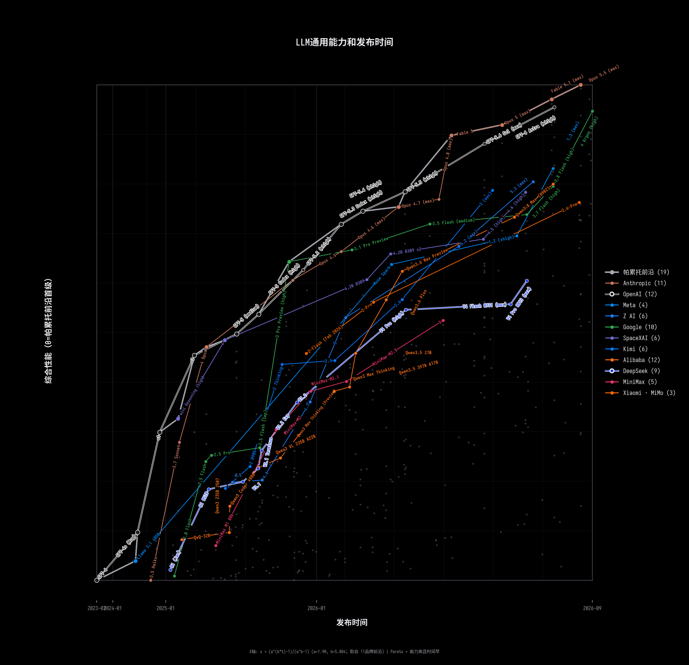

# LLM Leaderboard — 综合能力 vs 发布时间

## 全部模型（综合能力从高到低，最优 = 1，最差 = 0）

共收录 **Status: All**（含已弃用）的全部模型；按重新归一化后的综合能力排序。「帕累托」项：✅ = 总体帕累托前沿模型，❌ = 被支配。图表纵轴以总体帕累托前沿第一级（y0 = 0.2422，即前沿左端点 GPT-4）为 0：综合能力 ≥ 该级的 431 个模型入图，155 个能力低于第一级的不出现在图中；发布时间大于品牌前沿最大值的模型同样不入图（表列出全部模型）。

| # | 品牌 | 模型 | 综合能力 | 发布时间 | 横轴位置 | 帕累托 |
|---|------|------|---------|-----------|-----------|------|
| 1 |  Anthropic | Claude Opus 5.5 (max with fallback) | 1.0000 | 2026-09-22 | 0.9767 | ✅ |
| 2 |  Anthropic | Claude Opus 5.5 (xhigh with fallback) | 0.9940 | 2026-09-22 | 0.9767 | ❌ |
| 3 |  Anthropic | Claude Fable 5.1 (max with fallback) | 0.9779 | 2026-09-01 | 0.9180 | ✅ |
| 4 |  Anthropic | Claude Sonnet 5.5 (max with fallback) | 0.9777 | 2026-09-28 | 0.9941 | ❌ |
| 5 |  Anthropic | Claude Fable 5.1 (xhigh with fallback) | 0.9706 | 2026-09-01 | 0.9180 | ❌ |
| 6 |  OpenAI | GPT-6 Astra (xhigh) | 0.9658 | 2026-09-03 | 0.9234 | ❌ |
| 7 |  OpenAI | GPT-6 Astra (max) | 0.9616 | 2026-09-03 | 0.9234 | ❌ |
| 8 |  Google | Gemini 4 Argon (high) | 0.9596 | 2026-09-30 | 1.0000 | ❌ |
| 9 |  Anthropic | Claude Opus 5.5 (high with fallback) | 0.9528 | 2026-09-22 | 0.9767 | ❌ |
| 10 |  OpenAI | GPT-6 Astra (high) | 0.9430 | 2026-09-03 | 0.9234 | ❌ |
| 11 |  Anthropic | Claude Opus 5 (max) | 0.9387 | 2026-07-24 | 0.8179 | ✅ |
| 12 |  Anthropic | Claude Fable 5.1 (high with fallback) | 0.9387 | 2026-09-01 | 0.9180 | ❌ |
| 13 |  OpenAI | GPT-6.1 Sol (max) | 0.9353 | 2026-09-29 | 0.9971 | ❌ |
| 14 |  OpenAI | GPT-6.1 Sol (xhigh) | 0.9266 | 2026-09-29 | 0.9971 | ❌ |
| 15 |  Anthropic | Claude Opus 5 (xhigh) | 0.9241 | 2026-07-24 | 0.8179 | ❌ |
| 16 |  Anthropic | Claude Fable 5 (with fallback) | 0.9225 | 2026-06-09 | 0.7156 | ✅ |
| 17 |  Anthropic | Claude Opus 5.5 (medium with fallback) | 0.9204 | 2026-09-22 | 0.9767 | ❌ |
| 18 |  OpenAI | GPT-6 Astra (medium) | 0.9198 | 2026-09-03 | 0.9234 | ❌ |
| 19 |  OpenAI | GPT-6.1 Sol (high) | 0.9168 | 2026-09-29 | 0.9971 | ❌ |
| 20 |  Anthropic | Claude Opus 5 (high) | 0.9105 | 2026-07-24 | 0.8179 | ❌ |
| 21 |  OpenAI | GPT-5.6 Sol (max) | 0.9099 | 2026-07-09 | 0.7823 | ❌ |
| 22 |  Anthropic | Claude Fable 5.1 (medium with fallback) | 0.8997 | 2026-09-01 | 0.9180 | ❌ |
| 23 |  Anthropic | Claude Sonnet 5.5 (xhigh with fallback) | 0.8936 | 2026-09-28 | 0.9941 | ❌ |
| 24 |  OpenAI | GPT-6.1 Sol (medium) | 0.8840 | 2026-09-29 | 0.9971 | ❌ |
| 25 |  OpenAI | GPT-6 Astra (low) | 0.8765 | 2026-09-03 | 0.9234 | ❌ |
| 26 |  OpenAI | GPT-6 Sol (max) | 0.8760 | 2026-09-22 | 0.9767 | ❌ |
| 27 |  Meta | Muse Spark 1.3 (max) | 0.8720 | 2026-09-02 | 0.9207 | ❌ |
| 28 |  Meta | Muse Spark 1.3 (xhigh) | 0.8669 | 2026-09-02 | 0.9207 | ❌ |
| 29 |  Anthropic | Claude Fable 5.1 (low with fallback) | 0.8629 | 2026-09-01 | 0.9180 | ❌ |
| 30 |  Anthropic | Claude Opus 5 (medium) | 0.8599 | 2026-07-24 | 0.8179 | ❌ |
| 31 |  OpenAI | GPT-5.6 Sol (xhigh) | 0.8541 | 2026-07-09 | 0.7823 | ❌ |
| 32 |  Z AI | GLM-5.3 (max) | 0.8517 | 2026-08-18 | 0.8808 | ❌ |
| 33 |  Alibaba | Qwen3.8 Max (0902) | 0.8480 | 2026-09-02 | 0.9207 | ❌ |
| 34 |  Google | Gemini 3.8 Flash (high) | 0.8449 | 2026-09-02 | 0.9207 | ❌ |
| 35 |  OpenAI | GPT-5.6 Terra (max) | 0.8429 | 2026-07-09 | 0.7823 | ❌ |
| 36 |  Kimi | Kimi K3 (max) | 0.8386 | 2026-07-16 | 0.7988 | ❌ |
| 37 |  OpenAI | GPT-5.5 (xhigh) | 0.8364 | 2026-04-23 | 0.6220 | ✅ |
| 38 |  SpaceXAI | Grok 4.6 (high) | 0.8358 | 2026-08-12 | 0.8653 | ❌ |
| 39 |  OpenAI | GPT-5.6 Sol (high) | 0.8309 | 2026-07-09 | 0.7823 | ❌ |
| 40 |  SpaceXAI | Grok 4.6 (xhigh) | 0.8307 | 2026-08-12 | 0.8653 | ❌ |
| 41 |  Anthropic | Claude Opus 4.8 (max) | 0.8250 | 2026-05-28 | 0.6905 | ❌ |
| 42 |  Xiaomi | MiMo-V2.6-Pro | 0.8200 | 2026-09-21 | 0.9738 | ❌ |
| 43 |  OpenAI | GPT-6.1 Sol (low) | 0.8180 | 2026-09-29 | 0.9971 | ❌ |
| 44 |  OpenAI | GPT-6 Sol (xhigh) | 0.8171 | 2026-09-22 | 0.9767 | ❌ |
| 45 |  StepFun | Step 5 Preview | 0.8162 | 2026-09-18 | 0.9652 | ❌ |
| 46 |  Anthropic | Claude Opus 4.7 (max) | 0.8133 | 2026-04-16 | 0.6091 | ✅ |
| 47 |  SpaceXAI | Grok 4.6 (medium) | 0.8133 | 2026-08-12 | 0.8653 | ❌ |
| 48 |  OpenAI | GPT-5.4 (xhigh) | 0.8066 | 2026-03-05 | 0.5370 | ✅ |
| 49 |  Z AI | GLM-5.3-Flash | 0.8059 | 2026-08-26 | 0.9018 | ❌ |
| 50 |  Google | Gemini 3.8 Flash (medium) | 0.8030 | 2026-09-02 | 0.9207 | ❌ |
| 51 |  OpenAI | GPT-5.6 Sol (medium) | 0.8027 | 2026-07-09 | 0.7823 | ❌ |
| 52 |  OpenAI | GPT-5.5 (high) | 0.8021 | 2026-04-23 | 0.6220 | ❌ |
| 53 |  Google | Gemini 3.7 Flash (high) | 0.8015 | 2026-08-13 | 0.8678 | ❌ |
| 54 |  SpaceXAI | Grok 4.7 (xhigh) | 0.8002 | 2026-09-21 | 0.9738 | ❌ |
| 55 |  Anthropic | Claude Sonnet 5.5 (high with fallback) | 0.7998 | 2026-09-28 | 0.9941 | ❌ |
| 56 |  Alibaba | Qwen3.8 Max | 0.7973 | 2026-08-03 | 0.8425 | ❌ |
| 57 |  SpaceXAI | Grok 4.7 (high) | 0.7933 | 2026-09-21 | 0.9738 | ❌ |
| 58 |  OpenAI | GPT-6 Sol (high) | 0.7929 | 2026-09-22 | 0.9767 | ❌ |
| 59 |  Anthropic | Claude Opus 5.5 (low with fallback) | 0.7924 | 2026-09-22 | 0.9767 | ❌ |
| 60 |  Google | Gemini 3.7 Flash (medium) | 0.7917 | 2026-08-13 | 0.8678 | ❌ |
| 61 |  Google | Gemini 3.5 Flash (medium) | 0.7870 | 2026-05-19 | 0.6722 | ❌ |
| 62 |  OpenAI | GPT-5.3 Codex (xhigh) | 0.7869 | 2026-02-05 | 0.4935 | ✅ |
| 63 |  Anthropic | Claude Opus 5 (low) | 0.7770 | 2026-07-24 | 0.8179 | ❌ |
| 64 |  Alibaba | Qwen3.8 2.4T A95B | 0.7724 | 2026-08-12 | 0.8653 | ❌ |
| 65 |  Anthropic | Claude Sonnet 5 (max) | 0.7695 | 2026-06-30 | 0.7617 | ❌ |
| 66 |  Meta | Muse Spark 1.2 (xhigh) | 0.7687 | 2026-08-05 | 0.8475 | ❌ |
| 67 |  Google | Gemini 3.5 Flash (high) | 0.7687 | 2026-05-19 | 0.6722 | ❌ |
| 68 |  SpaceXAI | Grok 4.5 (high) | 0.7640 | 2026-07-08 | 0.7800 | ❌ |
| 69 |  OpenAI | GPT-6 Sol (medium) | 0.7602 | 2026-09-22 | 0.9767 | ❌ |
| 70 |  OpenAI | GPT-5.6 Terra (xhigh) | 0.7581 | 2026-07-09 | 0.7823 | ❌ |
| 71 |  Anthropic | Claude Haiku 5.5 (max) | 0.7579 | 2026-10-07 | 1.0000 | ❌ |
| 72 |  OpenAI | GPT-5.5 (medium) | 0.7569 | 2026-04-23 | 0.6220 | ❌ |
| 73 |  Z AI | GLM-5.2 (max) | 0.7529 | 2026-06-16 | 0.7307 | ❌ |
| 74 |  SpaceXAI | Grok 4.7 (low) | 0.7501 | 2026-09-21 | 0.9738 | ❌ |
| 75 |  Alibaba | Qwen3.8-Flash-Next | 0.7479 | 2026-08-26 | 0.9018 | ❌ |
| 76 |  Google | Gemini 3.1 Pro Preview | 0.7474 | 2026-02-19 | 0.5148 | ❌ |
| 77 |  Google | Gemini 3.7 Flash (low) | 0.7459 | 2026-08-13 | 0.8678 | ❌ |
| 78 |  Anthropic | Claude Opus 4.6 (max) | 0.7448 | 2026-02-05 | 0.4935 | ❌ |
| 79 |  SpaceXAI | Grok 4.20 0309 v2 | 0.7413 | 2026-04-07 | 0.5929 | ❌ |
| 80 |  Google | Gemini 3 Pro Preview (high) | 0.7294 | 2025-11-18 | 0.3882 | ✅ |
| 81 |  SpaceXAI | Grok 4.3 (medium) | 0.7274 | 2026-04-30 | 0.6351 | ❌ |
| 82 |  OpenAI | GPT-5.6 Sol (low) | 0.7264 | 2026-07-09 | 0.7823 | ❌ |
| 83 |  Anthropic | Claude Haiku 5.5 (xhigh) | 0.7257 | 2026-10-07 | 1.0000 | ❌ |
| 84 |  Meta | Muse Spark | 0.7252 | 2026-04-08 | 0.5947 | ❌ |
| 85 |  InclusionAI | Ling 3.1 Flash | 0.7245 | 2026-10-01 | 1.0000 | ❌ |
| 86 |  Meta | Muse Spark 1.1 (xhigh) | 0.7229 | 2026-07-09 | 0.7823 | ❌ |
| 87 |  OpenAI | GPT-5.2 (xhigh) | 0.7166 | 2025-12-11 | 0.4164 | ❌ |
| 88 |  OpenAI | GPT-5.2 Codex (xhigh) | 0.7161 | 2025-12-11 | 0.4164 | ❌ |
| 89 |  Google | Gemini 3.6 Flash (high) | 0.7157 | 2026-07-21 | 0.8107 | ❌ |
| 90 |  OpenAI | GPT-5.6 Luna (max) | 0.7156 | 2026-07-09 | 0.7823 | ❌ |
| 91 |  Alibaba | Qwen3.6 Max Preview | 0.7150 | 2026-04-20 | 0.6164 | ❌ |
| 92 |  OpenAI | GPT-5.6 Terra (high) | 0.7129 | 2026-07-09 | 0.7823 | ❌ |
| 93 |  Anthropic | Claude Sonnet 5.5 (medium with fallback) | 0.7091 | 2026-09-28 | 0.9941 | ❌ |
| 94 |  Google | Gemini 3.8 Flash (low) | 0.7073 | 2026-09-02 | 0.9207 | ❌ |
| 95 |  SpaceXAI | Grok 4.20 0309 | 0.7020 | 2026-03-10 | 0.5451 | ❌ |
| 96 |  Anthropic | Claude Opus 4.5 | 0.7012 | 2025-11-24 | 0.3954 | ❌ |
| 97 |  DeepSeek | DeepSeek V4 Pro 0813 (max) | 0.7002 | 2026-08-13 | 0.8678 | ❌ |
| 98 |  OpenAI | GPT-5.5 (low) | 0.6987 | 2026-04-23 | 0.6220 | ❌ |
| 99 |  Anthropic | Claude Opus 4.7 (non-reasoning, high) | 0.6961 | 2026-04-16 | 0.6091 | ❌ |
| 100 |  DeepSeek | DeepSeek V4.1 Flash (max) | 0.6927 | 2026-09-10 | 0.9427 | ❌ |
| 101 |  Google | Gemini 3 Flash | 0.6855 | 2025-12-17 | 0.4241 | ❌ |
| 102 |  SpaceXAI | Grok 4.6 (low) | 0.6817 | 2026-08-12 | 0.8653 | ❌ |
| 103 |  Alibaba | Qwen3.7 Max | 0.6815 | 2026-05-19 | 0.6722 | ❌ |
| 104 |  OpenAI | GPT-6 Sol (low) | 0.6797 | 2026-09-22 | 0.9767 | ❌ |
| 105 |  OpenAI | GPT-6 Luna (max) | 0.6791 | 2026-09-22 | 0.9767 | ❌ |
| 106 |  OpenAI | GPT-5.4 (low) | 0.6785 | 2026-03-05 | 0.5370 | ❌ |
| 107 |  Motif Technologies | Motif 3 | 0.6771 | 2026-08-12 | 0.8653 | ❌ |
| 108 |  Alibaba | Qwen3.8 27B (xhigh) | 0.6735 | 2026-08-14 | 0.8704 | ❌ |
| 109 |  Kimi | Kimi K2.6 | 0.6717 | 2026-04-20 | 0.6164 | ❌ |
| 110 |  Alibaba | Qwen3.6 Plus | 0.6711 | 2026-04-02 | 0.5841 | ❌ |
| 111 |  SpaceXAI | Grok 4.3 (low) | 0.6702 | 2026-04-30 | 0.6351 | ❌ |
| 112 |  OpenAI | GPT-5.6 Luna (xhigh) | 0.6678 | 2026-07-09 | 0.7823 | ❌ |
| 113 |  Xiaomi | MiMo-V2-Pro | 0.6674 | 2026-03-18 | 0.5584 | ❌ |
| 114 |  Anthropic | Claude Haiku 5.5 (high) | 0.6662 | 2026-10-07 | 1.0000 | ❌ |
| 115 |  Mistral | Mistral Large 4 Preview | 0.6647 | 2026-10-06 | 1.0000 | ❌ |
| 116 |  DeepSeek | DeepSeek V4 Flash Vision (max) | 0.6644 | 2026-08-21 | 0.8886 | ❌ |
| 117 |  DeepSeek | DeepSeek V4 Flash 0731 (max) | 0.6644 | 2026-07-31 | 0.8351 | ❌ |
| 118 |  OpenAI | GPT-5.2 (medium) | 0.6622 | 2025-12-11 | 0.4164 | ❌ |
| 119 |  Anthropic | Claude Sonnet 4.6 (max) | 0.6570 | 2026-02-17 | 0.5117 | ❌ |
| 120 |  DeepSeek | DeepSeek V4 Pro (high) | 0.6558 | 2026-04-24 | 0.6239 | ❌ |
| 121 |  OpenAI | GPT-5 Codex (high) | 0.6489 | 2025-09-23 | 0.3267 | ✅ |
| 122 |  OpenAI | GPT-5.6 Terra (medium) | 0.6443 | 2026-07-09 | 0.7823 | ❌ |
| 123 |  Z AI | GLM-5 | 0.6439 | 2026-02-11 | 0.5025 | ❌ |
| 124 |  China Mobile | JT-4.1 Flash 236B A21B | 0.6434 | 2026-07-09 | 0.7823 | ❌ |
| 125 |  Kimi | Kimi K3 (low) | 0.6428 | 2026-07-16 | 0.7988 | ❌ |
| 126 |  DeepSeek | DeepSeek V4 Pro (max) | 0.6426 | 2026-04-24 | 0.6239 | ❌ |
| 127 |  Xiaomi | MiMo-V2.6-Flash | 0.6415 | 2026-09-21 | 0.9738 | ❌ |
| 128 |  MiniMax | MiniMax-M3 | 0.6395 | 2026-06-01 | 0.6988 | ❌ |
| 129 |  OpenAI | GPT-5.1 (high) | 0.6373 | 2025-11-13 | 0.3823 | ❌ |
| 130 |  Anthropic | Claude Sonnet 5.5 (low with fallback) | 0.6371 | 2026-09-28 | 0.9941 | ❌ |
| 131 |  Alibaba | Qwen3.7 Plus | 0.6326 | 2026-06-01 | 0.6988 | ❌ |
| 132 |  OpenAI | GPT-5.1 Codex (high) | 0.6308 | 2025-11-13 | 0.3823 | ❌ |
| 133 |  OpenAI | GPT-6 Luna (xhigh) | 0.6308 | 2026-09-22 | 0.9767 | ❌ |
| 134 |  OpenAI | GPT-5.6 Luna (high) | 0.6290 | 2026-07-09 | 0.7823 | ❌ |
| 135 |  Xiaomi | MiMo-V2-Omni-0327 | 0.6210 | 2026-03-27 | 0.5737 | ❌ |
| 136 |  Z AI | GLM-5.1 | 0.6209 | 2026-04-07 | 0.5929 | ❌ |
| 137 |  OpenAI | GPT-5 (medium) | 0.6189 | 2025-08-07 | 0.2823 | ✅ |
| 138 |  Anthropic | Claude Sonnet 5 (xhigh) | 0.6188 | 2026-06-30 | 0.7617 | ❌ |
| 139 |  Anthropic | Claude Opus 4.6 (non-reasoning, high) | 0.6116 | 2026-02-05 | 0.4935 | ❌ |
| 140 |  Z AI | GLM-5-Turbo | 0.6112 | 2026-03-15 | 0.5534 | ❌ |
| 141 |  Motif Technologies | Motif 3 (Beta) | 0.6106 | 2026-07-14 | 0.7940 | ❌ |
| 142 |  SpaceXAI | Grok 4 | 0.6094 | 2025-07-10 | 0.2585 | ✅ |
| 143 |  Anthropic | Claude Haiku 5.5 (medium) | 0.6074 | 2026-10-07 | 1.0000 | ❌ |
| 144 |  Institute of Foundation Models | K2 Horizon 375B A23B | 0.6059 | 2026-09-03 | 0.9234 | ❌ |
| 145 |  Z AI | GLM-5.3 (low) | 0.6050 | 2026-08-18 | 0.8808 | ❌ |
| 146 |  Kimi | Kimi K2.7 Code | 0.6034 | 2026-06-12 | 0.7220 | ❌ |
| 147 |  SpaceXAI | Grok Build 0.1 0616 | 0.6032 | 2026-06-16 | 0.7307 | ❌ |
| 148 |  SpaceXAI | Grok 4.3 (high) | 0.6026 | 2026-04-30 | 0.6351 | ❌ |
| 149 |  Nex AGI | Nex-N2-Pro | 0.6021 | 2026-06-02 | 0.7009 | ❌ |
| 150 |  OpenAI | GPT-5.5 Instant (May 2026) | 0.6006 | 2026-05-05 | 0.6447 | ❌ |
| 151 |  Anthropic | Claude 4 Opus | 0.5989 | 2025-05-22 | 0.2213 | ✅ |
| 152 |  OpenAI | GPT-5.4 mini (xhigh) | 0.5985 | 2026-03-17 | 0.5567 | ❌ |
| 153 |  OpenAI | GPT-6 Luna (high) | 0.5985 | 2026-09-22 | 0.9767 | ❌ |
| 154 |  OpenAI | GPT-5 (high) | 0.5919 | 2025-08-07 | 0.2823 | ❌ |
| 155 |  Google | Gemini 3.5 Flash (minimal) | 0.5895 | 2026-05-19 | 0.6722 | ❌ |
| 156 |  Alibaba | Qwen3.5 27B | 0.5893 | 2026-02-24 | 0.5226 | ❌ |
| 157 |  Xiaomi | MiMo-V2-Flash (Feb 2026) | 0.5890 | 2025-12-16 | 0.4228 | ❌ |
| 158 |  Xiaomi | MiMo-V2-Omni | 0.5868 | 2026-03-19 | 0.5601 | ❌ |
| 159 |  OpenAI | o3 | 0.5862 | 2025-04-16 | 0.1971 | ✅ |
| 160 |  Xiaomi | MiMo-V2.5-Pro | 0.5858 | 2026-04-22 | 0.6201 | ❌ |
| 161 |  OpenAI | GPT-5.6 Terra (low) | 0.5844 | 2026-07-09 | 0.7823 | ❌ |
| 162 |  Upstage | Solar Open2 250B | 0.5842 | 2026-08-12 | 0.8653 | ❌ |
| 163 |  Z AI | GLM 5V Turbo | 0.5824 | 2026-04-01 | 0.5823 | ❌ |
| 164 |  OpenAI | GPT-5.6 Sol (non-reasoning) | 0.5813 | 2026-07-09 | 0.7823 | ❌ |
| 165 |  DeepSeek | DeepSeek V4 Flash (max) | 0.5811 | 2026-04-24 | 0.6239 | ❌ |
| 166 |  InclusionAI | Ling-3.0-flash-VL | 0.5798 | 2026-09-10 | 0.9427 | ❌ |
| 167 |  Xiaomi | MiMo-V2.5 | 0.5791 | 2026-04-22 | 0.6201 | ❌ |
| 168 |  Kimi | Kimi K2.5 | 0.5784 | 2026-01-27 | 0.4803 | ❌ |
| 169 |  Anthropic | Claude Sonnet 5 (high) | 0.5780 | 2026-06-30 | 0.7617 | ❌ |
| 170 |  OpenAI | GPT-5 mini (medium) | 0.5769 | 2025-08-07 | 0.2823 | ❌ |
| 171 |  Anthropic | Claude 4.1 Opus | 0.5744 | 2025-08-05 | 0.2805 | ❌ |
| 172 |  Apodex | Apodex 1.1 | 0.5740 | 2026-08-30 | 0.9126 | ❌ |
| 173 |  Anthropic | Claude Sonnet 4.6 (non-reasoning, high) | 0.5727 | 2026-02-17 | 0.5117 | ❌ |
| 174 |  Kimi | Kimi K2 Thinking | 0.5722 | 2025-11-06 | 0.3742 | ❌ |
| 175 |  Anthropic | Claude Opus 4.5 (non-reasoning) | 0.5702 | 2025-11-24 | 0.3954 | ❌ |
| 176 |  Anthropic | Claude Sonnet 5 (non-reasoning) | 0.5700 | 2026-06-30 | 0.7617 | ❌ |
| 177 |  Anthropic | Claude Sonnet 4.6 (non-reasoning, low) | 0.5673 | 2026-02-17 | 0.5117 | ❌ |
| 178 |  Thinking Machines | Inkling (xhigh) | 0.5666 | 2026-07-15 | 0.7964 | ❌ |
| 179 |  Kimi | Kimi K2.6 (non-reasoning) | 0.5651 | 2026-04-20 | 0.6164 | ❌ |
| 180 |  OpenAI | GPT-5.4 nano (xhigh) | 0.5642 | 2026-03-17 | 0.5567 | ❌ |
| 181 |  Google | Gemini 3 Pro Preview (low) | 0.5640 | 2025-11-18 | 0.3882 | ❌ |
| 182 |  OpenAI | GPT-6 Luna (medium) | 0.5614 | 2026-09-22 | 0.9767 | ❌ |
| 183 |  Thinking Machines | Inkling Small | 0.5610 | 2026-07-30 | 0.8326 | ❌ |
| 184 |  Multiverse Computing | Quasar 438B (max) | 0.5605 | 2026-08-10 | 0.8602 | ❌ |
| 185 |  DeepSeek | DeepSeek V4 Flash (high) | 0.5567 | 2026-04-24 | 0.6239 | ❌ |
| 186 |  OpenAI | GPT-5.1 Codex mini (high) | 0.5556 | 2025-11-13 | 0.3823 | ❌ |
| 187 |  Alibaba | Qwen3.6 27B | 0.5551 | 2026-04-22 | 0.6201 | ❌ |
| 188 |  China Mobile | JT-4.1 Flash 236B A21B (non-reasoning) | 0.5550 | 2026-07-09 | 0.7823 | ❌ |
| 189 |  Upstage | Solar Pro 4 | 0.5527 | 2026-08-06 | 0.8500 | ❌ |
| 190 |  OpenAI | GPT-5 (low) | 0.5517 | 2025-08-07 | 0.2823 | ❌ |
| 191 |  Tencent | Hy3-preview | 0.5517 | 2026-04-23 | 0.6220 | ❌ |
| 192 |  Anthropic | Claude 4.5 Sonnet | 0.5482 | 2025-09-29 | 0.3329 | ❌ |
| 193 |  MiniMax | MiniMax-M2.5 | 0.5463 | 2026-02-12 | 0.5040 | ❌ |
| 194 |  Anthropic | Claude Haiku 5.5 (low) | 0.5459 | 2026-10-07 | 1.0000 | ❌ |
| 195 |  Alibaba | Qwen3.8 27B (medium) | 0.5458 | 2026-08-14 | 0.8704 | ❌ |
| 196 |  NVIDIA | Nemotron 3 Ultra | 0.5453 | 2026-06-04 | 0.7050 | ❌ |
| 197 |  Z AI | GLM-5.1 (non-reasoning) | 0.5452 | 2026-04-07 | 0.5929 | ❌ |
| 198 |  Alibaba | Qwen3.5 Omni Plus | 0.5449 | 2026-03-30 | 0.5789 | ❌ |
| 199 |  SpaceXAI | Grok 4.1 Fast | 0.5380 | 2025-11-19 | 0.3894 | ❌ |
| 200 |  Alibaba | Qwen3.5 397B A17B | 0.5378 | 2026-02-16 | 0.5102 | ❌ |
| 201 |  KwaiKAT | KAT-Coder-Pro V2 | 0.5336 | 2026-03-27 | 0.5737 | ❌ |
| 202 |  OpenAI | GPT-5.4 nano (medium) | 0.5321 | 2026-03-17 | 0.5567 | ❌ |
| 203 |  Alibaba | Qwen3.8 27B (low) | 0.5319 | 2026-08-14 | 0.8704 | ❌ |
| 204 |  MiniMax | MiniMax-M2.7 | 0.5312 | 2026-03-18 | 0.5584 | ❌ |
| 205 |  MiniMax | MiniMax-M2.1 | 0.5312 | 2025-12-23 | 0.4319 | ❌ |
| 206 |  Alibaba | Qwen3 Max Thinking | 0.5311 | 2026-01-26 | 0.4788 | ❌ |
| 207 |  Tencent | Hy3 | 0.5288 | 2026-07-06 | 0.7754 | ❌ |
| 208 |  Google | Gemini 3.5 Flash-Lite | 0.5276 | 2026-07-21 | 0.8107 | ❌ |
| 209 |  Alibaba | Qwen3.5 35B A3B | 0.5258 | 2026-02-24 | 0.5226 | ❌ |
| 210 |  StepFun | Step 3.7 Flash | 0.5220 | 2026-05-29 | 0.6926 | ❌ |
| 211 |  OpenAI | GPT-5.6 Luna (medium) | 0.5218 | 2026-07-09 | 0.7823 | ❌ |
| 212 |  Kimi | Kimi K2.5 (non-reasoning) | 0.5205 | 2026-01-27 | 0.4803 | ❌ |
| 213 |  Xiaomi | MiMo-V2-Flash | 0.5193 | 2025-12-16 | 0.4228 | ❌ |
| 214 |  OpenAI | GPT-5.4 mini (medium) | 0.5181 | 2026-03-17 | 0.5567 | ❌ |
| 215 |  Institute of Foundation Models | K2 Horizon MoVA 36B A4B | 0.5174 | 2026-09-03 | 0.9234 | ❌ |
| 216 |  Z AI | GLM-4.7 | 0.5149 | 2025-12-22 | 0.4306 | ❌ |
| 217 |  DeepSeek | DeepSeek V3.2 | 0.5142 | 2025-12-01 | 0.4039 | ❌ |
| 218 |  Google | Gemini 3 Flash (non-reasoning) | 0.5135 | 2025-12-17 | 0.4241 | ❌ |
| 219 |  OpenAI | GPT-6 Sol (non-reasoning) | 0.5115 | 2026-09-22 | 0.9767 | ❌ |
| 220 |  Z AI | GLM-5 (non-reasoning) | 0.5093 | 2026-02-11 | 0.5025 | ❌ |
| 221 |  Alibaba | Qwen3.6 35B A3B | 0.5075 | 2026-04-16 | 0.6091 | ❌ |
| 222 |  Anthropic | Claude Sonnet 5 (medium) | 0.5069 | 2026-06-30 | 0.7617 | ❌ |
| 223 |  OpenAI | GPT-5.5 (non-reasoning) | 0.5066 | 2026-04-23 | 0.6220 | ❌ |
| 224 |  AI9Stars | G9v3-39A5B | 0.5065 | 2026-08-20 | 0.8860 | ❌ |
| 225 |  Alibaba | Qwen3.5 397B A17B (non-reasoning) | 0.5026 | 2026-02-16 | 0.5102 | ❌ |
| 226 |  StepFun | Step 3.5 Flash 2603 | 0.5025 | 2026-04-02 | 0.5841 | ❌ |
| 227 |  Alibaba | Qwen3.5 122B A10B | 0.4988 | 2026-02-24 | 0.5226 | ❌ |
| 228 |  Anthropic | Claude 4 Sonnet | 0.4962 | 2025-05-22 | 0.2213 | ❌ |
| 229 |  SpaceXAI | Grok 4 Fast | 0.4961 | 2025-09-19 | 0.3227 | ❌ |
| 230 |  SpaceXAI | Grok 3 mini Reasoning (high) | 0.4892 | 2025-02-19 | 0.1641 | ✅ |
| 231 |  Alibaba | Qwen3.5 27B (non-reasoning) | 0.4878 | 2026-02-24 | 0.5226 | ❌ |
| 232 |  Anthropic | Claude 4.5 Sonnet (non-reasoning) | 0.4874 | 2025-09-29 | 0.3329 | ❌ |
| 233 |  SK Telecom | A.X-K2 | 0.4872 | 2026-08-12 | 0.8653 | ❌ |
| 234 |  DeepSeek | DeepSeek V3.2 Speciale | 0.4866 | 2025-12-01 | 0.4039 | ❌ |
| 235 |  China Mobile | JT-35B-Flash | 0.4856 | 2026-05-14 | 0.6623 | ❌ |
| 236 |  StepFun | Step 3.5 Flash | 0.4848 | 2026-02-02 | 0.4891 | ❌ |
| 237 |  InclusionAI | Ling-3.0-flash-Fin | 0.4830 | 2026-09-11 | 0.9455 | ❌ |
| 238 |  LG AI Research | K-EXAONE 2.0 | 0.4818 | 2026-08-12 | 0.8653 | ❌ |
| 239 |  InclusionAI | Ling 3.0 Flash | 0.4786 | 2026-08-04 | 0.8450 | ❌ |
| 240 |  Alibaba | Qwen3.8 27B (non-reasoning) | 0.4763 | 2026-08-14 | 0.8704 | ❌ |
| 241 |  Google | Gemma 4 31B | 0.4757 | 2026-04-02 | 0.5841 | ❌ |
| 242 |  OpenAI | GPT-5.4 (non-reasoning) | 0.4725 | 2026-03-05 | 0.5370 | ❌ |
| 243 |  MiniMax | MiniMax-M2 | 0.4722 | 2025-10-26 | 0.3617 | ❌ |
| 244 |  OpenAI | GPT-5 mini (high) | 0.4694 | 2025-08-07 | 0.2823 | ❌ |
| 245 |  ByteDance Seed | Doubao Seed Code | 0.4689 | 2025-11-11 | 0.3799 | ❌ |
| 246 |  OpenAI | o4-mini (high) | 0.4686 | 2025-04-16 | 0.1971 | ❌ |
| 247 |  OpenAI | o1 | 0.4686 | 2024-12-05 | 0.1271 | ✅ |
| 248 |  Meta | Muse Glimmer (high) | 0.4682 | 2026-08-10 | 0.8602 | ❌ |
| 249 |  Upstage | Solar Mini 4 | 0.4678 | 2026-09-22 | 0.9767 | ❌ |
| 250 |  OpenAI | GPT-5.6 Luna (low) | 0.4666 | 2026-07-09 | 0.7823 | ❌ |
| 251 |  OpenAI | GPT-6 Luna (low) | 0.4651 | 2026-09-22 | 0.9767 | ❌ |
| 252 |  Z AI | GLM-5.2 (non-reasoning) | 0.4606 | 2026-06-16 | 0.7307 | ❌ |
| 253 |  DeepSeek | DeepSeek V4 Pro (non-reasoning) | 0.4574 | 2026-04-24 | 0.6239 | ❌ |
| 254 |  Alibaba | Qwen3.6 27B (non-reasoning) | 0.4551 | 2026-04-22 | 0.6201 | ❌ |
| 255 |  Anthropic | Claude 3.7 Sonnet | 0.4532 | 2025-02-24 | 0.1669 | ❌ |
| 256 |  OpenAI | GPT-5.5 Instant (June 2026) | 0.4527 | 2026-06-25 | 0.7505 | ❌ |
| 257 |  Anthropic | Claude 4 Sonnet (non-reasoning) | 0.4504 | 2025-05-22 | 0.2213 | ❌ |
| 258 |  Anthropic | Claude Sonnet 5 (low) | 0.4489 | 2026-06-30 | 0.7617 | ❌ |
| 259 |  Mistral | Mistral Medium 3.5 | 0.4478 | 2026-04-29 | 0.6333 | ❌ |
| 260 |  InclusionAI | Ring-2.6-1T | 0.4468 | 2026-05-08 | 0.6505 | ❌ |
| 261 |  Google | Gemini 2.5 Flash (Sep) | 0.4448 | 2025-09-25 | 0.3288 | ❌ |
| 262 |  KwaiKAT | KAT-Coder-Pro V1 | 0.4405 | 2025-11-11 | 0.3799 | ❌ |
| 263 |  DeepSeek | DeepSeek V3.2 Exp | 0.4405 | 2025-09-29 | 0.3329 | ❌ |
| 264 |  Amazon | Nova 2.0 Pro Preview (medium) | 0.4398 | 2025-11-27 | 0.3990 | ❌ |
| 265 |  OpenAI | GPT-5.2 (non-reasoning) | 0.4382 | 2025-12-11 | 0.4164 | ❌ |
| 266 |  Anthropic | Claude 4.5 Haiku | 0.4368 | 2025-10-15 | 0.3497 | ❌ |
| 267 |  DeepSeek | DeepSeek V4.1 Flash (non-reasoning) | 0.4366 | 2026-09-10 | 0.9427 | ❌ |
| 268 |  Cohere | Command A+ | 0.4363 | 2026-05-20 | 0.6742 | ❌ |
| 269 |  OpenAI | GPT-5.6 Terra (non-reasoning) | 0.4356 | 2026-07-09 | 0.7823 | ❌ |
| 270 |  Alibaba | Qwen3.5 122B A10B (non-reasoning) | 0.4352 | 2026-02-24 | 0.5226 | ❌ |
| 271 |  Google | Gemini 2.5 Pro | 0.4334 | 2025-06-05 | 0.2314 | ❌ |
| 272 |  Institute of Foundation Models | K2 Horizon 7B | 0.4328 | 2026-09-03 | 0.9234 | ❌ |
| 273 |  Anthropic | Claude 3.7 Sonnet (non-reasoning) | 0.4301 | 2025-02-24 | 0.1669 | ❌ |
| 274 |  Alibaba | Qwen3 Max Thinking (Preview) | 0.4291 | 2025-11-03 | 0.3707 | ❌ |
| 275 |  Google | Gemini 2.5 Flash | 0.4240 | 2025-05-20 | 0.2199 | ❌ |
| 276 |  Amazon | Nova 2.0 Lite (medium) | 0.4238 | 2025-10-29 | 0.3651 | ❌ |
| 277 |  LongCat | LongCat 2.0 | 0.4200 | 2026-06-29 | 0.7595 | ❌ |
| 278 |  Xiaomi | MiMo-V2.5-Pro (non-reasoning) | 0.4190 | 2026-04-22 | 0.6201 | ❌ |
| 279 |  Anthropic | Claude 4.5 Haiku (non-reasoning) | 0.4188 | 2025-10-15 | 0.3497 | ❌ |
| 280 |  Google | Gemma 4 26B A4B | 0.4167 | 2026-04-02 | 0.5841 | ❌ |
| 281 |  Kimi | Kimi K2 0905 | 0.4161 | 2025-09-05 | 0.3090 | ❌ |
| 282 |  Baidu | ERNIE 5.0 Thinking Preview | 0.4155 | 2025-11-13 | 0.3823 | ❌ |
| 283 |  DeepSeek | DeepSeek V4 Flash (non-reasoning) | 0.4148 | 2026-04-24 | 0.6239 | ❌ |
| 284 |  Alibaba | Qwen3 VL 235B A22B | 0.4147 | 2025-09-23 | 0.3267 | ❌ |
| 285 |  Amazon | Nova 2.0 Pro Preview (low) | 0.4135 | 2025-11-27 | 0.3990 | ❌ |
| 286 |  DeepSeek | DeepSeek V3.1 Terminus | 0.4134 | 2025-09-22 | 0.3257 | ❌ |
| 287 |  SpaceXAI | Grok 4.20 0309 (non-reasoning) | 0.4123 | 2026-03-10 | 0.5451 | ❌ |
| 288 |  InclusionAI | Ling-2.6-1T | 0.4119 | 2026-04-23 | 0.6220 | ❌ |
| 289 |  Google | Gemini 3.1 Flash-Lite | 0.4112 | 2026-03-03 | 0.5338 | ❌ |
| 290 |  Amazon | Nova 2.0 Omni (low) | 0.4084 | 2025-11-26 | 0.3978 | ❌ |
| 291 |  DeepSeek | DeepSeek V3.2 (non-reasoning) | 0.4062 | 2025-12-01 | 0.4039 | ❌ |
| 292 |  Tencent | Hy3-preview (non-reasoning) | 0.4044 | 2026-04-23 | 0.6220 | ❌ |
| 293 |  OpenAI | GPT-5 nano (high) | 0.4043 | 2025-08-07 | 0.2823 | ❌ |
| 294 |  OpenAI | GPT-5 nano (medium) | 0.4022 | 2025-08-07 | 0.2823 | ❌ |
| 295 |  Z AI | GLM-4.7 (non-reasoning) | 0.4014 | 2025-12-22 | 0.4306 | ❌ |
| 296 |  Alibaba | Qwen3.6 35B A3B (non-reasoning) | 0.4002 | 2026-04-16 | 0.6091 | ❌ |
| 297 |  Amazon | Nova 2.0 Omni (medium) | 0.4002 | 2025-11-26 | 0.3978 | ❌ |
| 298 |  Alibaba | Qwen3.5 4B | 0.3964 | 2026-03-02 | 0.5321 | ❌ |
| 299 |  SpaceXAI | Grok 4.20 0309 v2 (non-reasoning) | 0.3963 | 2026-04-07 | 0.5929 | ❌ |
| 300 |  Z AI | GLM-4.6 | 0.3953 | 2025-09-30 | 0.3339 | ❌ |
| 301 |  LG AI Research | EXAONE 4.5 33B | 0.3931 | 2026-04-09 | 0.5965 | ❌ |
| 302 |  DeepSeek | DeepSeek V3.1 | 0.3928 | 2025-08-21 | 0.2949 | ❌ |
| 303 |  Z AI | GLM-4.5 | 0.3922 | 2025-07-28 | 0.2736 | ❌ |
| 304 |  Google | Gemma 4 12B | 0.3878 | 2026-06-03 | 0.7029 | ❌ |
| 305 |  Alibaba | Qwen3.5 9B | 0.3871 | 2026-03-02 | 0.5321 | ❌ |
| 306 |  Amazon | Nova 2.0 Lite (high) | 0.3868 | 2025-10-29 | 0.3651 | ❌ |
| 307 |  Alibaba | Qwen3 Max | 0.3864 | 2025-09-23 | 0.3267 | ❌ |
| 308 |  SpaceXAI | Grok Code Fast 1 | 0.3836 | 2025-08-28 | 0.3014 | ❌ |
| 309 |  Kimi | Kimi K2 | 0.3826 | 2025-07-11 | 0.2594 | ❌ |
| 310 |  DeepSeek | DeepSeek R1 0528 | 0.3812 | 2025-05-28 | 0.2256 | ❌ |
| 311 |  LG AI Research | K-EXAONE | 0.3779 | 2025-12-31 | 0.4425 | ❌ |
| 312 |  Google | Gemini 2.5 Flash (Sep) (non-reasoning) | 0.3756 | 2025-09-25 | 0.3288 | ❌ |
| 313 |  Google | Gemma 4 31B (non-reasoning) | 0.3750 | 2026-04-02 | 0.5841 | ❌ |
| 314 |  OpenAI | GPT-5 (minimal) | 0.3728 | 2025-08-07 | 0.2823 | ❌ |
| 315 |  Alibaba | Qwen3.5 35B A3B (non-reasoning) | 0.3724 | 2026-02-24 | 0.5226 | ❌ |
| 316 |  Alibaba | Qwen3 VL 32B | 0.3719 | 2025-10-21 | 0.3562 | ❌ |
| 317 |  OpenAI | GPT-4.1 | 0.3709 | 2025-04-14 | 0.1958 | ❌ |
| 318 |  Xiaomi | MiMo-V2-Flash (non-reasoning) | 0.3697 | 2025-12-16 | 0.4228 | ❌ |
| 319 |  OpenAI | GPT-5.1 (non-reasoning) | 0.3692 | 2025-11-13 | 0.3823 | ❌ |
| 320 |  Amazon | Nova 2.0 Lite (low) | 0.3689 | 2025-10-29 | 0.3651 | ❌ |
| 321 |  Z AI | GLM-4.7-Flash | 0.3678 | 2026-01-19 | 0.4688 | ❌ |
| 322 |  Z AI | GLM-4.6 (non-reasoning) | 0.3643 | 2025-09-30 | 0.3339 | ❌ |
| 323 |  ServiceNow | Apriel-v1.5-15B-Thinker | 0.3605 | 2025-09-30 | 0.3339 | ❌ |
| 324 |  SpaceXAI | Grok 4.3 (non-reasoning) | 0.3605 | 2026-04-30 | 0.6351 | ❌ |
| 325 |  Alibaba | Qwen3.5 9B (non-reasoning) | 0.3579 | 2026-03-02 | 0.5321 | ❌ |
| 326 |  Alibaba | Qwen3.5 Omni Flash | 0.3566 | 2026-03-30 | 0.5789 | ❌ |
| 327 |  OpenAI | GPT-6 Luna (non-reasoning) | 0.3557 | 2026-09-22 | 0.9767 | ❌ |
| 328 |  Alibaba | Qwen3 Coder 480B | 0.3556 | 2025-07-22 | 0.2685 | ❌ |
| 329 |  Google | Gemini 2.5 Flash-Lite (Sep) | 0.3546 | 2025-09-25 | 0.3288 | ❌ |
| 330 |  Deep Cogito | Cogito v2.1 | 0.3543 | 2025-11-18 | 0.3882 | ❌ |
| 331 |  NVIDIA | Nemotron 3 Super | 0.3537 | 2026-03-11 | 0.5468 | ❌ |
| 332 |  OpenAI | GPT-5.6 Luna (non-reasoning) | 0.3523 | 2026-07-09 | 0.7823 | ❌ |
| 333 |  ServiceNow | Apriel-v1.6-15B-Thinker | 0.3503 | 2025-11-25 | 0.3966 | ❌ |
| 334 |  Inception | Mercury 2 | 0.3497 | 2026-02-20 | 0.5164 | ❌ |
| 335 |  Google | Gemma 4 26B A4B (non-reasoning) | 0.3492 | 2026-04-02 | 0.5841 | ❌ |
| 336 |  SpaceXAI | Grok 3 | 0.3487 | 2025-02-19 | 0.1641 | ❌ |
| 337 |  Z AI | GLM-4.6V | 0.3479 | 2025-12-08 | 0.4126 | ❌ |
| 338 |  DeepSeek | DeepSeek V3.1 Terminus (non-reasoning) | 0.3472 | 2025-09-22 | 0.3257 | ❌ |
| 339 |  NVIDIA | Nemotron Cascade 2 30B A3B | 0.3447 | 2026-03-19 | 0.5601 | ❌ |
| 340 |  OpenAI | GPT-5 (ChatGPT) | 0.3431 | 2025-08-07 | 0.2823 | ❌ |
| 341 |  DeepSeek | DeepSeek V4 Pro 0813 (non-reasoning) | 0.3426 | 2026-08-13 | 0.8678 | ❌ |
| 342 |  Institute of Foundation Models | K2 Horizon 3.7B | 0.3381 | 2026-09-03 | 0.9234 | ❌ |
| 343 |  Arcee AI | Trinity Large Thinking | 0.3371 | 2026-04-01 | 0.5823 | ❌ |
| 344 |  Mistral | Magistral Medium 1.2 | 0.3363 | 2025-09-18 | 0.3217 | ❌ |
| 345 |  Alibaba | Qwen3 Max (Preview) | 0.3360 | 2025-09-05 | 0.3090 | ❌ |
| 346 |  IBM | Granite 4.2 30B | 0.3315 | 2026-08-25 | 0.8992 | ❌ |
| 347 |  OpenBMB | MiniCPM5-2B | 0.3313 | 2026-09-07 | 0.9344 | ❌ |
| 348 |  DeepSeek | DeepSeek V3.2 Exp (non-reasoning) | 0.3297 | 2025-09-29 | 0.3329 | ❌ |
| 349 |  NVIDIA | Nemotron 3.5 Lightning | 0.3279 | 2026-08-11 | 0.8627 | ❌ |
| 350 |  Google | Gemini 2.5 Flash-Lite (Sep) (non-reasoning) | 0.3273 | 2025-09-25 | 0.3288 | ❌ |
| 351 |  InclusionAI | Ling 3.0 Tiny | 0.3266 | 2026-08-06 | 0.8500 | ❌ |
| 352 |  DeepSeek | DeepSeek V3.1 (non-reasoning) | 0.3265 | 2025-08-21 | 0.2949 | ❌ |
| 353 |  OpenAI | gpt-oss-120b (high) | 0.3236 | 2025-08-05 | 0.2805 | ❌ |
| 354 |  ByteDance Seed | Seed-OSS-36B-Instruct | 0.3227 | 2025-08-20 | 0.2940 | ❌ |
| 355 |  Alibaba | Qwen3 235B A22B 2507 | 0.3199 | 2025-07-25 | 0.2710 | ❌ |
| 356 |  Google | Gemini 2.5 Flash (non-reasoning) | 0.3171 | 2025-05-20 | 0.2199 | ❌ |
| 357 |  OpenAI | GPT-4o (Aug) | 0.3157 | 2024-08-06 | 0.0825 | ✅ |
| 358 |  AI9Stars | G9v3-3B | 0.3156 | 2026-07-23 | 0.8155 | ❌ |
| 359 |  Alibaba | Qwen3 235B 2507 | 0.3153 | 2025-07-21 | 0.2677 | ❌ |
| 360 |  Google | Gemini 2.5 Flash-Lite | 0.3128 | 2025-06-17 | 0.2404 | ❌ |
| 361 |  SpaceXAI | Grok 4.1 Fast (non-reasoning) | 0.3090 | 2025-11-19 | 0.3894 | ❌ |
| 362 |  OpenAI | GPT-5 mini (minimal) | 0.3082 | 2025-08-07 | 0.2823 | ❌ |
| 363 |  Cohere | North Mini Code | 0.3080 | 2026-06-09 | 0.7156 | ❌ |
| 364 |  Mistral | Mistral Small 4 | 0.3075 | 2026-03-16 | 0.5550 | ❌ |
| 365 |  Google | Gemma 4 12B (non-reasoning) | 0.3069 | 2026-06-03 | 0.7029 | ❌ |
| 366 |  Alibaba | Qwen3 VL 235B A22B | 0.3063 | 2025-09-23 | 0.3267 | ❌ |
| 367 |  Alibaba | QwQ-32B | 0.3045 | 2025-03-05 | 0.1719 | ❌ |
| 368 |  InclusionAI | Ring-1T | 0.3034 | 2025-10-13 | 0.3476 | ❌ |
| 369 |  OpenBMB | MiniCPM5-1B | 0.3034 | 2026-05-25 | 0.6844 | ❌ |
| 370 |  OpenBMB | MiniCPM5-1B (non-reasoning) | 0.3032 | 2026-05-25 | 0.6844 | ❌ |
| 371 |  Institute of Foundation Models | K2 Think V2 | 0.3026 | 2025-12-15 | 0.4215 | ❌ |
| 372 |  Mistral | Pixtral Large | 0.3021 | 2024-11-18 | 0.1198 | ❌ |
| 373 |  Upstage | Solar Open 100B | 0.2987 | 2025-12-17 | 0.4241 | ❌ |
| 374 |  Multiverse Computing | HyperNova 60B 2605 (high) | 0.2959 | 2026-05-26 | 0.6864 | ❌ |
| 375 |  OpenAI | o3-mini | 0.2958 | 2025-01-31 | 0.1541 | ❌ |
| 376 |  Z AI | GLM-4.5-Air | 0.2952 | 2025-07-28 | 0.2736 | ❌ |
| 377 |  MiniMax | MiniMax M1 80k | 0.2951 | 2025-06-17 | 0.2404 | ❌ |
| 378 |  OpenAI | GPT-5.4 nano (non-reasoning) | 0.2925 | 2026-03-17 | 0.5567 | ❌ |
| 379 |  Alibaba | Qwen3.5 4B (non-reasoning) | 0.2922 | 2026-03-02 | 0.5321 | ❌ |
| 380 |  OpenAI | GPT-4o (Nov) | 0.2905 | 2024-11-20 | 0.1206 | ❌ |
| 381 |  China Mobile | JT-MINI | 0.2905 | 2026-04-15 | 0.6073 | ❌ |
| 382 |  Alibaba | Qwen3 Next 80B A3B | 0.2903 | 2025-09-11 | 0.3148 | ❌ |
| 383 |  Mistral | Mistral Medium 3 | 0.2886 | 2025-05-07 | 0.2109 | ❌ |
| 384 |  MiniMax | MiniMax M1 40k | 0.2882 | 2025-06-17 | 0.2404 | ❌ |
| 385 |  Naver | HyperCLOVA X SEED Think (32B) | 0.2881 | 2025-12-26 | 0.4359 | ❌ |
| 386 |  SpaceXAI | Grok 4 Fast (non-reasoning) | 0.2864 | 2025-09-19 | 0.3227 | ❌ |
| 387 |  Alibaba | Qwen3 Coder Next | 0.2859 | 2026-02-03 | 0.4905 | ❌ |
| 388 |  Institute of Foundation Models | K2-V2 (high) | 0.2859 | 2025-12-05 | 0.4089 | ❌ |
| 389 |  LG AI Research | K-EXAONE (non-reasoning) | 0.2856 | 2025-12-31 | 0.4425 | ❌ |
| 390 |  OpenAI | GPT-5.4 mini (non-reasoning) | 0.2850 | 2026-03-17 | 0.5567 | ❌ |
| 391 |  Amazon | Nova 2.0 Pro Preview (non-reasoning) | 0.2846 | 2025-11-27 | 0.3990 | ❌ |
| 392 |  Korea Telecom | Mi:dm K 2.5 Pro | 0.2829 | 2025-12-11 | 0.4164 | ❌ |
| 393 |  Upstage | Solar Pro 3 | 0.2825 | 2026-04-06 | 0.5911 | ❌ |
| 394 |  IBM | Granite 4.2 8B | 0.2815 | 2026-08-25 | 0.8992 | ❌ |
| 395 |  OpenAI | o3-mini (high) | 0.2805 | 2025-01-31 | 0.1541 | ❌ |
| 396 |  Prime Intellect | INTELLECT-3 | 0.2762 | 2025-11-27 | 0.3990 | ❌ |
| 397 |  Google | DiffusionGemma 26B A4B | 0.2760 | 2026-06-10 | 0.7178 | ❌ |
| 398 |  Trillion Labs | Tri-21B-think Preview | 0.2753 | 2026-02-10 | 0.5010 | ❌ |
| 399 |  LongCat | LongCat Flash Lite | 0.2737 | 2026-01-28 | 0.4817 | ❌ |
| 400 |  Alibaba | Qwen3 VL 30B A3B | 0.2734 | 2025-10-03 | 0.3370 | ❌ |
| 401 |  OpenAI | gpt-oss-20b (low) | 0.2729 | 2025-08-05 | 0.2805 | ❌ |
| 402 |  Meta | Llama 3.1 405B | 0.2718 | 2024-07-23 | 0.0782 | ✅ |
| 403 |  Amazon | Nova Premier | 0.2710 | 2025-04-30 | 0.2062 | ❌ |
| 404 |  InclusionAI | Ling 2.6 Flash | 0.2706 | 2026-04-21 | 0.6183 | ❌ |
| 405 |  NVIDIA | Nemotron 3 Nano | 0.2699 | 2025-12-15 | 0.4215 | ❌ |
| 406 |  Google | Gemma 4 E4B (non-reasoning) | 0.2698 | 2026-04-03 | 0.5858 | ❌ |
| 407 |  Trillion Labs | Tri-21B-Think | 0.2696 | 2026-02-10 | 0.5010 | ❌ |
| 408 |  Inception | Mercury 2.5 | 0.2629 | 2026-09-08 | 0.9372 | ❌ |
| 409 |  Amazon | Nova 2.0 Lite (non-reasoning) | 0.2625 | 2025-10-29 | 0.3651 | ❌ |
| 410 |  Alibaba | Qwen3 Next 80B A3B | 0.2618 | 2025-09-11 | 0.3148 | ❌ |
| 411 |  Alibaba | Qwen3 VL 32B | 0.2615 | 2025-10-21 | 0.3562 | ❌ |
| 412 |  NVIDIA | Nemotron 3 Nano Omni 30B A3B | 0.2601 | 2026-04-29 | 0.6333 | ❌ |
| 413 |  Nous Research | Hermes 4 405B | 0.2598 | 2025-08-27 | 0.3005 | ❌ |
| 414 |  OpenAI | GPT-4.1 mini | 0.2588 | 2025-04-14 | 0.1958 | ❌ |
| 415 |  DeepSeek | DeepSeek R1 (Jan) | 0.2582 | 2025-01-20 | 0.1485 | ❌ |
| 416 |  Institute of Foundation Models | K2-V2 (medium) | 0.2573 | 2025-12-05 | 0.4089 | ❌ |
| 417 |  InclusionAI | Ling-1T | 0.2565 | 2025-10-08 | 0.3422 | ❌ |
| 418 |  DeepSeek | DeepSeek V3 0324 | 0.2564 | 2025-03-25 | 0.1835 | ❌ |
| 419 |  Google | Gemma 4 E4B | 0.2562 | 2026-04-03 | 0.5858 | ❌ |
| 420 |  Korea Telecom | Mi:dm K 2.5 Pro Preview | 0.2561 | 2025-12-11 | 0.4164 | ❌ |
| 421 |  Motif Technologies | Motif-2-12.7B | 0.2560 | 2025-12-04 | 0.4076 | ❌ |
| 422 |  Mistral | Mistral Large 3 | 0.2539 | 2025-12-02 | 0.4051 | ❌ |
| 423 |  Mistral | Mistral Medium 3.1 | 0.2531 | 2025-08-12 | 0.2868 | ❌ |
| 424 |  Alibaba | Qwen3 VL 8B | 0.2529 | 2025-10-14 | 0.3486 | ❌ |
| 425 |  OpenAI | gpt-oss-20b (high) | 0.2513 | 2025-08-05 | 0.2805 | ❌ |
| 426 |  StepFun | Step3 VL 10B | 0.2511 | 2026-01-20 | 0.4702 | ❌ |
| 427 |  Meta | Llama 4 Maverick | 0.2497 | 2025-04-05 | 0.1902 | ❌ |
| 428 |  NVIDIA | Llama Nemotron Super 49B v1.5 | 0.2490 | 2025-07-25 | 0.2710 | ❌ |
| 429 |  Google | Gemini 2.0 Flash | 0.2487 | 2025-02-05 | 0.1567 | ❌ |
| 430 |  Z AI | GLM-4.7-Flash (non-reasoning) | 0.2486 | 2026-01-19 | 0.4688 | ❌ |
| 431 |  OpenAI | gpt-oss-120b (low) | 0.2477 | 2025-08-05 | 0.2805 | ❌ |
| 432 |  Baidu | ERNIE 4.5 300B A47B | 0.2459 | 2025-06-30 | 0.2505 | ❌ |
| 433 |  Mistral | Magistral Medium 1 | 0.2449 | 2025-06-10 | 0.2351 | ❌ |
| 434 |  Mistral | Devstral Medium | 0.2433 | 2025-07-10 | 0.2585 | ❌ |
| 435 |  Alibaba | Qwen3 4B 2507 | 0.2428 | 2025-08-06 | 0.2814 | ❌ |
| 436 |  Anthropic | Claude 3.5 Haiku | 0.2422 | 2024-10-22 | 0.1090 | ❌ |
| 437 |  Amazon | Nova 2.0 Omni (non-reasoning) | 0.2422 | 2025-11-26 | 0.3978 | ❌ |
| 438 |  OpenAI | GPT-4 | 0.2422 | 2023-03-14 | 0.0000 | ✅ |
| 439 |  Mistral | Mistral Small 4 (non-reasoning) | 0.2417 | 2026-03-16 | 0.5550 | ❌ |
| 440 |  Nous Research | Hermes 4 405B (non-reasoning) | 0.2406 | 2025-08-27 | 0.3005 | ❌ |
| 441 |  Alibaba | Qwen3 Coder 30B A3B | 0.2393 | 2025-07-31 | 0.2762 | ❌ |
| 442 |  Alibaba | Qwen3 30B A3B 2507 | 0.2372 | 2025-07-30 | 0.2753 | ❌ |
| 443 |  Liquid AI | LFM2.5-8B-A1B | 0.2370 | 2026-05-28 | 0.6905 | ❌ |
| 444 |  Mistral | Devstral 2 | 0.2368 | 2025-12-09 | 0.4139 | ❌ |
| 445 |  Alibaba | Qwen3 VL 30B A3B | 0.2362 | 2025-10-03 | 0.3370 | ❌ |
| 446 |  Z AI | GLM-4.6V (non-reasoning) | 0.2356 | 2025-12-08 | 0.4126 | ❌ |
| 447 |  Alibaba | Qwen3 Omni 30B A3B | 0.2338 | 2025-09-22 | 0.3257 | ❌ |
| 448 |  IBM | Granite 4.2 3B | 0.2332 | 2026-08-25 | 0.8992 | ❌ |
| 449 |  Alibaba | Qwen3 235B | 0.2297 | 2025-04-28 | 0.2049 | ❌ |
| 450 |  Z AI | GLM-4.5V | 0.2289 | 2025-08-11 | 0.2859 | ❌ |
| 451 |  NVIDIA | NVIDIA Nemotron Nano 12B v2 VL | 0.2282 | 2025-10-28 | 0.3640 | ❌ |
| 452 |  Mistral | Mistral Large 2 (Nov) | 0.2272 | 2024-11-18 | 0.1198 | ❌ |
| 453 |  TII UAE | Falcon-H1R-7B | 0.2258 | 2026-01-04 | 0.4479 | ❌ |
| 454 |  NVIDIA | Llama Nemotron Ultra | 0.2248 | 2025-04-07 | 0.1915 | ❌ |
| 455 |  Mistral | Devstral Small 2 | 0.2165 | 2025-12-09 | 0.4139 | ❌ |
| 456 |  Google | Gemma 4 E2B | 0.2160 | 2026-04-02 | 0.5841 | ❌ |
| 457 |  Amazon | Nova Pro | 0.2158 | 2024-12-03 | 0.1262 | ❌ |
| 458 |  Liquid AI | LFM2.5-2.6B | 0.2152 | 2026-08-04 | 0.8450 | ❌ |
| 459 |  Allen Institute for AI | Olmo 3.1 32B Think | 0.2150 | 2025-12-12 | 0.4177 | ❌ |
| 460 |  Sarvam | Sarvam 105B (high) | 0.2141 | 2026-03-06 | 0.5386 | ❌ |
| 461 |  LG AI Research | EXAONE 4.0 32B | 0.2132 | 2025-07-15 | 0.2627 | ❌ |
| 462 |  Institute of Foundation Models | K2-V2 (low) | 0.2117 | 2025-12-05 | 0.4089 | ❌ |
| 463 |  NVIDIA | NVIDIA Nemotron Nano 9B V2 | 0.2112 | 2025-08-18 | 0.2922 | ❌ |
| 464 |  InclusionAI | Ring-flash-2.0 | 0.2087 | 2025-09-19 | 0.3227 | ❌ |
| 465 |  Google | Gemini 2.5 Flash-Lite (non-reasoning) | 0.2086 | 2025-06-17 | 0.2404 | ❌ |
| 466 |  NVIDIA | Llama Nemotron Super 49B v1.5 (non-reasoning) | 0.2070 | 2025-07-25 | 0.2710 | ❌ |
| 467 |  Nous Research | Hermes 4 70B | 0.2050 | 2025-08-27 | 0.3005 | ❌ |
| 468 |  Mistral | Devstral Small (May) | 0.2040 | 2025-05-21 | 0.2206 | ❌ |
| 469 |  Amazon | Nova Lite | 0.2033 | 2024-12-03 | 0.1262 | ❌ |
| 470 |  Mistral | Magistral Small 1.2 | 0.2005 | 2025-09-17 | 0.3207 | ❌ |
| 471 |  NVIDIA | Llama 3.3 Nemotron Super 49B | 0.2003 | 2025-03-18 | 0.1794 | ❌ |
| 472 |  DeepSeek | DeepSeek R1 Distill Qwen 32B | 0.1999 | 2025-01-20 | 0.1485 | ❌ |
| 473 |  DeepSeek | DeepSeek V3 (Dec) | 0.1997 | 2024-12-26 | 0.1365 | ❌ |
| 474 |  Alibaba | Qwen2.5 72B | 0.1993 | 2024-09-19 | 0.0969 | ❌ |
| 475 |  InclusionAI | Ling-flash-2.0 | 0.1984 | 2025-09-17 | 0.3207 | ❌ |
| 476 |  Nanbeige | Nanbeige4.1-3B | 0.1982 | 2026-02-11 | 0.5025 | ❌ |
| 477 |  Alibaba | Qwen3 VL 8B | 0.1979 | 2025-10-14 | 0.3486 | ❌ |
| 478 |  Alibaba | Qwen3.5 2B | 0.1969 | 2026-03-02 | 0.5321 | ❌ |
| 479 |  Alibaba | Qwen3 30B | 0.1964 | 2025-04-28 | 0.2049 | ❌ |
| 480 |  Mistral | Magistral Small 1 | 0.1960 | 2025-06-10 | 0.2351 | ❌ |
| 481 |  Mistral | Mistral Large 2 (Jul) | 0.1921 | 2024-07-24 | 0.0785 | ❌ |
| 482 |  Upstage | Solar Pro 2 | 0.1913 | 2025-07-09 | 0.2577 | ❌ |
| 483 |  Cohere | Command A | 0.1912 | 2025-03-13 | 0.1765 | ❌ |
| 484 |  Mistral | Devstral Small | 0.1906 | 2025-07-10 | 0.2585 | ❌ |
| 485 |  Mistral | Mistral Small 3.2 | 0.1905 | 2025-06-20 | 0.2427 | ❌ |
| 486 |  Alibaba | Qwen3 235B (non-reasoning) | 0.1903 | 2025-04-28 | 0.2049 | ❌ |
| 487 |  NVIDIA | Llama 3.1 Nemotron 70B | 0.1890 | 2024-10-15 | 0.1064 | ❌ |
| 488 |  Alibaba | Qwen3 VL 4B | 0.1864 | 2025-10-14 | 0.3486 | ❌ |
| 489 |  Anthropic | Claude 3 Haiku | 0.1854 | 2024-03-04 | 0.0439 | ❌ |
| 490 |  NVIDIA | Llama 3.3 Nemotron Super 49B (non-reasoning) | 0.1838 | 2025-03-18 | 0.1794 | ❌ |
| 491 |  Alibaba | Qwen3 30B A3B 2507 (non-reasoning) | 0.1821 | 2025-07-29 | 0.2745 | ❌ |
| 492 |  Meta | Llama 4 Scout | 0.1817 | 2025-04-05 | 0.1902 | ❌ |
| 493 |  Alibaba | Qwen3 4B | 0.1806 | 2025-04-28 | 0.2049 | ❌ |
| 494 |  Meta | Llama 3.1 70B | 0.1801 | 2024-07-23 | 0.0782 | ❌ |
| 495 |  NVIDIA | NVIDIA Nemotron Nano 9B V2 (non-reasoning) | 0.1799 | 2025-08-18 | 0.2922 | ❌ |
| 496 |  Alibaba | Qwen3 32B | 0.1790 | 2025-04-28 | 0.2049 | ❌ |
| 497 |  Alibaba | Qwen3 32B (non-reasoning) | 0.1784 | 2025-04-28 | 0.2049 | ❌ |
| 498 |  Mistral | Mistral Small 3.1 | 0.1783 | 2025-03-17 | 0.1788 | ❌ |
| 499 |  Z AI | GLM-4.5V (non-reasoning) | 0.1780 | 2025-08-11 | 0.2859 | ❌ |
| 500 |  Google | Gemma 4 E2B (non-reasoning) | 0.1779 | 2026-04-02 | 0.5841 | ❌ |
| 501 |  Alibaba | Qwen3 14B | 0.1744 | 2025-04-28 | 0.2049 | ❌ |
| 502 |  Mistral | Ministral 3 14B | 0.1730 | 2025-12-02 | 0.4051 | ❌ |
| 503 |  Allen Institute for AI | Olmo 3.1 32B Instruct | 0.1725 | 2026-01-13 | 0.4603 | ❌ |
| 504 |  Alibaba | Qwen3 Omni 30B A3B | 0.1708 | 2025-09-22 | 0.3257 | ❌ |
| 505 |  OpenAI | GPT-5 nano (minimal) | 0.1702 | 2025-08-07 | 0.2823 | ❌ |
| 506 |  Alibaba | Qwen3 4B 2507 (non-reasoning) | 0.1691 | 2025-08-06 | 0.2814 | ❌ |
| 507 |  Allen Institute for AI | Olmo 3 32B Think | 0.1648 | 2025-11-20 | 0.3905 | ❌ |
| 508 |  DeepSeek | DeepSeek R1 Distill Llama 70B | 0.1641 | 2025-01-20 | 0.1485 | ❌ |
| 509 |  DeepSeek | DeepSeek R1 Distill Qwen 14B | 0.1637 | 2025-01-20 | 0.1485 | ❌ |
| 510 |  Kimi | Kimi Linear 48B A3B Instruct | 0.1634 | 2025-10-30 | 0.3662 | ❌ |
| 511 |  IBM | Granite 4.1 30B | 0.1627 | 2026-04-29 | 0.6333 | ❌ |
| 512 |  Upstage | Solar Pro 2 (non-reasoning) | 0.1619 | 2025-07-09 | 0.2577 | ❌ |
| 513 |  Alibaba | Qwen3.5 2B (non-reasoning) | 0.1618 | 2026-03-02 | 0.5321 | ❌ |
| 514 |  Nous Research | Hermes 4 70B (non-reasoning) | 0.1588 | 2025-08-27 | 0.3005 | ❌ |
| 515 |  AI21 Labs | Jamba Reasoning 3B | 0.1585 | 2025-10-08 | 0.3422 | ❌ |
| 516 |  LG AI Research | EXAONE 4.0 32B (non-reasoning) | 0.1563 | 2025-07-15 | 0.2627 | ❌ |
| 517 |  NVIDIA | Nemotron 3 Nano 4B | 0.1560 | 2026-03-16 | 0.5550 | ❌ |
| 518 |  Meta | Llama 3.3 70B | 0.1546 | 2024-12-06 | 0.1275 | ❌ |
| 519 |  OpenAI | GPT-4.1 nano | 0.1544 | 2025-04-14 | 0.1958 | ❌ |
| 520 |  Meta | Llama 3.1 8B | 0.1538 | 2024-07-23 | 0.0782 | ❌ |
| 521 |  Amazon | Nova Micro | 0.1534 | 2024-12-03 | 0.1262 | ❌ |
| 522 |  Liquid AI | LFM2 24B A2B | 0.1530 | 2026-02-25 | 0.5242 | ❌ |
| 523 |  AI21 Labs | Jamba 1.7 Large | 0.1519 | 2025-07-07 | 0.2561 | ❌ |
| 524 |  Sarvam | Sarvam 30B (high) | 0.1500 | 2026-03-06 | 0.5386 | ❌ |
| 525 |  OpenAI | GPT-4o mini | 0.1494 | 2024-07-18 | 0.0768 | ❌ |
| 526 |  Mistral | Mistral Small 3 | 0.1486 | 2025-01-30 | 0.1536 | ❌ |
| 527 |  NVIDIA | NVIDIA Nemotron Nano 12B v2 VL (non-reasoning) | 0.1483 | 2025-10-28 | 0.3640 | ❌ |
| 528 |  Celeris | Celeris-1 | 0.1463 | 2026-07-24 | 0.8179 | ❌ |
| 529 |  IBM | Granite 4.1 8B | 0.1446 | 2026-04-29 | 0.6333 | ❌ |
| 530 |  Alibaba | Qwen3 30B (non-reasoning) | 0.1438 | 2025-04-28 | 0.2049 | ❌ |
| 531 |  Mistral | Ministral 3 8B | 0.1429 | 2025-12-02 | 0.4051 | ❌ |
| 532 |  NVIDIA | Nemotron 3 Nano (non-reasoning) | 0.1412 | 2025-12-15 | 0.4215 | ❌ |
| 533 |  IBM | Granite 4.0 H Small | 0.1380 | 2025-09-22 | 0.3257 | ❌ |
| 534 |  Alibaba | Qwen3 VL 4B | 0.1376 | 2025-10-14 | 0.3486 | ❌ |
| 535 |  OpenBMB | MiniCPM-V 4.6 1.3B | 0.1357 | 2026-05-11 | 0.6564 | ❌ |
| 536 |  DeepSeek | DeepSeek R1 0528 Qwen3 8B | 0.1336 | 2025-05-29 | 0.2263 | ❌ |
| 537 |  Alibaba | Qwen3 14B (non-reasoning) | 0.1319 | 2025-04-28 | 0.2049 | ❌ |
| 538 |  Alibaba | Qwen3 8B | 0.1309 | 2025-04-28 | 0.2049 | ❌ |
| 539 |  Microsoft | Phi-4 | 0.1273 | 2024-12-12 | 0.1301 | ❌ |
| 540 |  NVIDIA | Llama 3.1 Nemotron Nano 4B v1.1 | 0.1264 | 2025-05-20 | 0.2199 | ❌ |
| 541 |  Google | Gemma 3 270M | 0.1243 | 2025-08-14 | 0.2885 | ❌ |
| 542 |  Google | Gemma 3 27B | 0.1199 | 2025-03-12 | 0.1759 | ❌ |
| 543 |  Meta | Llama 3 70B | 0.1192 | 2024-04-18 | 0.0534 | ❌ |
| 544 |  Meta | Llama 3.2 11B (Vision) | 0.1187 | 2024-09-25 | 0.0990 | ❌ |
| 545 |  Meta | Llama 3.2 3B | 0.1168 | 2024-09-25 | 0.0990 | ❌ |
| 546 |  Allen Institute for AI | Olmo 3 7B Think | 0.1153 | 2025-11-20 | 0.3905 | ❌ |
| 547 |  Mistral | Ministral 3 3B | 0.1137 | 2025-12-02 | 0.4051 | ❌ |
| 548 |  Liquid AI | LFM2.5-1.2B-Instruct | 0.1087 | 2026-01-05 | 0.4493 | ❌ |
| 549 |  Reka AI | Reka Flash 3 | 0.1082 | 2025-03-10 | 0.1747 | ❌ |
| 550 |  InclusionAI | Ling-mini-2.0 | 0.1078 | 2025-09-09 | 0.3129 | ❌ |
| 551 |  Liquid AI | LFM2 2.6B | 0.1077 | 2025-09-23 | 0.3267 | ❌ |
| 552 |  Alibaba | Qwen3 8B (non-reasoning) | 0.1068 | 2025-04-28 | 0.2049 | ❌ |
| 553 |  Alibaba | Qwen3.5 0.8B | 0.1058 | 2026-03-02 | 0.5321 | ❌ |
| 554 |  Allen Institute for AI | Molmo2-8B | 0.1035 | 2025-12-11 | 0.4164 | ❌ |
| 555 |  Sarvam | Sarvam M | 0.1033 | 2025-05-23 | 0.2220 | ❌ |
| 556 |  AI21 Labs | Jamba 1.7 Mini | 0.1020 | 2025-07-07 | 0.2561 | ❌ |
| 557 |  Liquid AI | LFM2.5-1.2B-Thinking | 0.1006 | 2026-01-20 | 0.4702 | ❌ |
| 558 |  Swiss AI Initiative | Apertus 70B Instruct | 0.0938 | 2025-09-02 | 0.3061 | ❌ |
| 559 |  Allen Institute for AI | Olmo 3 7B | 0.0924 | 2025-11-20 | 0.3905 | ❌ |
| 560 |  LG AI Research | Exaone 4.0 1.2B | 0.0914 | 2025-07-15 | 0.2627 | ❌ |
| 561 |  Allen Institute for AI | OLMo 2 32B | 0.0913 | 2025-03-13 | 0.1765 | ❌ |
| 562 |  IBM | Granite 4.0 H 1B | 0.0908 | 2025-10-28 | 0.3640 | ❌ |
| 563 |  Meta | Llama 3.2 1B | 0.0897 | 2024-09-25 | 0.0990 | ❌ |
| 564 |  Microsoft | Phi-4 Mini | 0.0891 | 2024-02-26 | 0.0426 | ❌ |
| 565 |  Alibaba | Qwen3 1.7B | 0.0886 | 2025-04-28 | 0.2049 | ❌ |
| 566 |  Alibaba | Qwen3.5 0.8B (non-reasoning) | 0.0853 | 2026-03-02 | 0.5321 | ❌ |
| 567 |  LG AI Research | Exaone 4.0 1.2B (non-reasoning) | 0.0844 | 2025-07-15 | 0.2627 | ❌ |
| 568 |  Google | Gemma 3 12B | 0.0836 | 2025-03-12 | 0.1759 | ❌ |
| 569 |  Liquid AI | LFM2 8B A1B | 0.0826 | 2025-10-07 | 0.3412 | ❌ |
| 570 |  IBM | Granite 4.0 Micro | 0.0800 | 2025-09-22 | 0.3257 | ❌ |
| 571 |  IBM | Granite 4.1 3B | 0.0793 | 2026-04-29 | 0.6333 | ❌ |
| 572 |  Microsoft | Phi-3 Mini | 0.0751 | 2024-04-23 | 0.0545 | ❌ |
| 573 |  IBM | Granite 3.3 8B (non-reasoning) | 0.0717 | 2025-04-16 | 0.1971 | ❌ |
| 574 |  Liquid AI | LFM2.5-VL-1.6B | 0.0691 | 2026-01-05 | 0.4493 | ❌ |
| 575 |  IBM | Granite 4.0 1B | 0.0684 | 2025-10-28 | 0.3640 | ❌ |
| 576 |  IBM | Granite 4.0 350M | 0.0674 | 2025-10-28 | 0.3640 | ❌ |
| 577 |  Liquid AI | LFM2 1.2B | 0.0655 | 2025-07-10 | 0.2585 | ❌ |
| 578 |  Alibaba | Qwen3 0.6B | 0.0649 | 2025-04-28 | 0.2049 | ❌ |
| 579 |  Meta | Llama 3 8B | 0.0646 | 2024-04-18 | 0.0534 | ❌ |
| 580 |  Mistral | Mistral 7B | 0.0622 | 2023-09-27 | 0.0188 | ❌ |
| 581 |  Google | Gemma 3 4B | 0.0603 | 2025-03-12 | 0.1759 | ❌ |
| 582 |  Alibaba | Qwen3 1.7B (non-reasoning) | 0.0567 | 2025-04-28 | 0.2049 | ❌ |
| 583 |  Allen Institute for AI | OLMo 2 7B | 0.0565 | 2024-11-26 | 0.1232 | ❌ |
| 584 |  Google | Gemma 3 1B | 0.0561 | 2025-03-13 | 0.1765 | ❌ |
| 585 |  Swiss AI Initiative | Apertus 8B Instruct | 0.0552 | 2025-09-02 | 0.3061 | ❌ |
| 586 |  Google | Gemma 3n E4B | 0.0532 | 2025-06-26 | 0.2474 | ❌ |
| 587 |  IBM | Granite 4.0 H 350M | 0.0510 | 2025-10-28 | 0.3640 | ❌ |
| 588 |  Allen Institute for AI | Molmo 7B-D | 0.0478 | 2024-09-25 | 0.0990 | ❌ |
| 589 |  Institute of Foundation Models | K2 Horizon 0.9B | 0.0458 | 2026-09-03 | 0.9234 | ❌ |
| 590 |  Alibaba | Qwen3 0.6B (non-reasoning) | 0.0438 | 2025-04-28 | 0.2049 | ❌ |
| 591 |  Google | Gemma 3n E2B | 0.0361 | 2025-06-26 | 0.2474 | ❌ |
| 592 |  Cohere | Tiny Aya Global | 0.0357 | 2026-02-17 | 0.5117 | ❌ |
| 593 |  DeepSeek | DeepSeek R1 Distill Qwen 1.5B | 0.0000 | 2025-01-20 | 0.1485 | ❌ |

## 品牌帕累托前沿连线（仅体现在图中）

以下十一个品牌在图中拥有单独的帕累托连线（较窄宽度，品牌主题色，图层高于总体灰色连线）。表中数量为**入图顶点数**——品牌前沿上低于总体前沿第一级的顶点同样不入图（本表与图例一致）：

| 品牌 | 主题色 | 品牌前沿模型数（入图） |
|------|--------|--------------|
|  Anthropic | `#cc785c` | 11 |
|  OpenAI | `#1f1f1f` | 12 |
|  Meta | `#0089f4` | 4 |
|  Z AI | `#1c7ff8` | 6 |
|  Google | `#34A853` | 10 |
|  SpaceXAI | `#736cd3` | 6 |
|  Kimi | `#047AFE` | 6 |
|  Alibaba | `#ff7018` | 12 |
|  DeepSeek | `#2243e6` | 9 |
|  MiniMax | `#EB3568` | 5 |
|  Xiaomi | `#ff6900` | 3 |

## 评分方法

1. **20项评估指标**各自线性归一化到 [0,1]
   （AA Intelligence Index、GPQA Diamond、Humanity's Last Exam、MMMU Pro、IFBench Instruction Following、SciCode Coding、CritPt Physics、AA-LCR Long Context、AA Omniscience Index、AA-Omniscience Accuracy、AA-Omniscience Non-Hallucination、GDPval-AA Normalized、AA Analyst Agent、APEX-Agents-AA、ITBench-SRE、τ²-Bench Telecom、τ³-Bench Banking、Terminal-Bench Hard、Terminal-Bench 2.1、Terminal-Bench 4.0）
   > V18（2026-09-12）：AA 更新了基准列——新增 AA Analyst Agent、τ³-Bench Banking、Terminal-Bench 2.1 / 4.0 四项；AA Agentic Index 与 AA Coding Index 已从 AA 的数据源中移除，相应剔除。指标数由 18 → 20。
2. **综合能力值** = 所有有效归一化分数的算术平均
3. **综合能力再归一化**：线性映射到 [0,1]，性能最好的模型 = 1，最差的模型 = 0
4. **Pareto前沿** = 不被任何其他模型支配的模型（综合能力 ≥ 且发布时间 ≤（更早），且至少一项严格更优）
5. **模型范围** = Status: All（含已弃用模型；缺少足够评估数据者不参与排名）
6. **图表纵轴基线（V17）**：图表的 y = 0 取总体帕累托前沿的第一级（最低能力；本例 y0 = 0.2422，即前沿左端点 GPT-4）；综合能力低于该级的模型不出现在图表中（表格不受影响）。图中纵坐标 chart_y = (能力 - y0)/(1 - y0)，因此前沿左端点恰好落在 (0, 0)、最优模型恰好为 y = 1。该过滤在横轴映射构建之前完成

## 横轴映射（指数）

横轴为发布时间指数映射：x = (a^(b*t)-1)/(a^b-1)；t 为发布时间按最早和最大映射到 [0,1]；a = 1.901，b = 5.804，用 11 品牌前沿定出；mse = 0.002013。

- **函数端点**：最早发布 → x = 0；前沿最大发布 → x = 1；
- 横轴时间标签：2024-01, 2025-01, 2026-01, 2026-09
- 中位数位置 0.584；左 168 个，右 263 个
- 前沿最大发布时间 2026-09-30 → x = 1；大于该值的模型不入图，表格中有。

## 图中标注规则

品牌帕累托前沿模型全部标注。V13/V15/V16 规则：

1. **品牌公共前缀剔除（最长有效切点）**：品牌全部前沿模型共享的前导块被剔除 —— 切点须止于分界符（空格/连字符/下划线，如 'Claude '、'GPT-'、'GLM-'、'Grok '、'DeepSeek V4 '），或止于字母且每个名称在切点后紧跟数字（品牌/系列字母 + 版本号，如 'Kimi K|2.6'、'Qwen|3.8'、'MiMo-V|2.5'、'MiniMax-M|2.1'）—— 实例：Claude Opus 5 (high) → Opus 5 (high)、GPT-5.6 Sol → 5.6 Sol、Kimi K2.6 → 2.6、Qwen3.8 Max → 3.8 Max、MiMo-V2.5-Pro → 2.5-Pro；剔除后任一名称为空或产生重复标签则该切点作废，顺次尝试更短切点；
2. **(non-reasoning) → (non)**：思考程度中的 Non-reasoning 简写为 non（含组合式：Non-reasoning, high → non, high）；
3. **相邻同名 run 短标签（每次重新计算）**：品牌连线上连续 2 个以上顶点属于同一模型时，仅性能最低者（run 首位）保留全名，其后相邻的较高者只标思考程度（如 Opus 5 的 (low) (medium) (high) (xhigh) 序列仅首项带族名）；同名模型不相邻的重复出现不合并、保留全名 —— A-B(high)-B(xhigh)-C-B(max) 标注为 A-B(high)-(xhigh)-C-B(max)，因此交错家族（Gemini 3.7 / 3.8 Flash、Claude Fable 5.1 / Opus 5）始终可分辨。

4. **标签位置与序列同向（V15）**：品牌前沿上越靠右上的模型，其标签重心必须同时更靠右且更靠上 —— 对前沿相邻对 A→B（B 更靠右上），标签位移的两个分量须同时 >= 0（至少是 (0,0)），既不得更左、也不得更低（只要有一个分量非负不算合格；V14 的投影规则会放过「更右但更低」，V15 起视为违反；同时点堆叠即：上方模型的标签既在上方、也不更左）；初始放置违反时就近重摆（不产生新的重叠、不破坏与前后邻居的同向关系，最多 6 轮；单标签重摆无解——标签被前后邻居夹死、局部约束盒为空——时，自动升级为以违规对为中心逐级扩大的窗口级联重排，整段相邻标签作为一个阶梯整体重排，修不好的配对在日志中报告）。

5. **标签摆放四级优先（V16）**：① 尽量多的标签骑在连线段上——点的右侧（去路段）或左侧（来路段）皆可，同一条线段允许容纳两个标签（各贴各的点）；目标骑线位仅被其他标签占据时触发「让位」——占用者挪到自己的另一个骑线位，双方都保持骑线。② 骑不上线的标签在「假设线能放下该标签」的离点最近位置的上方或下方、与线平行摆放（右/左侧 × 上/下方四组合；互相掣肘的标签自然错开成对角组合）。③ 仍放不下时放在点的两条连线延长线上的最近点。④ 最后在两条连线夹角形成的扇区（连线前上方空白区）内就近放置，文字保持与邻近连线平行。

标注文字与连线平行且中轴线重合；文字下方不绘制连线，仅在文字两侧绘制（若两侧仍有区域）；文字使用品牌颜色，无边框、无背景。

## X：发布时间

**X = 发布时间（线性）**

发布时间为 releaseDate；左端为最早发布时间。

### 数据来源

**主数据源**: [Artificial Analysis Leaderboard](https://artificialanalysis.ai/leaderboards/models)（Status: All）  
**性能方法论**: [AA Performance Benchmarking](https://artificialanalysis.ai/methodology/performance-benchmarking)  
**模型数**: 593（总体帕累托前沿 19 个；图表入图 431 个）  

## 图表说明（黑底）

（V17 起本说明置于文末，图表之后直接跟随模型表格。）

图表说明：**灰色实线** = 总体帕累托前沿；**彩色细线** = 十一个品牌的单独帕累托前沿（品牌主题色，图层高于总体连线；暗色品牌元素带窄白边；顶点按（横轴位置、能力升序）连接，同时点按能力从低到高连接）；品牌前沿模型圆点同样使用品牌颜色。模型名称/思考程度标注优先骑在连线之上（点的左/右两侧皆可，同一条线段可容纳两个标签——各贴各的点；文字与连线平行、中轴线重合，连线仅在文字两侧绘制）；骑线位被其他标签占据时自动「让位」——占用者挪到自己的另一个骑线位，双方都保持骑线；实在骑不上线时按四级优先依次退让（V16）：离点最近位置的上方/下方平行偏移 → 点的两条连线延长线上就近 → 两连线夹角扇区内就近。标签规则（V13/V15）：品牌前沿模型共享的前导块按「最长有效切点」剔除 —— 切点止于分界符，或止于字母且其后紧跟数字（如 Claude Opus 5 → Opus 5、GPT-5.6 Sol → 5.6 Sol、Kimi K2.6 → 2.6、Qwen3.8 Max → 3.8 Max、MiMo-V2.5 → 2.5、MiniMax-M2.1 → 2.1）；(non-reasoning) 简写为 (non)；同一模型在品牌连线上相邻出现 2 次以上时仅性能最低者保留全名、相邻较高者只标思考程度，不相邻的重复出现保留全名（每次重新计算）；标签位置与序列同向（V15）——品牌前沿上越靠右上的模型，其标签重心必须同时更靠右且更靠上（两分量都 >= 0，至少是 (0,0)，仅其一非负不算合格；初始放置违反时自动就近重摆，单标签无解（被前后邻居夹死）时按窗口级联重排整体挪动，均不产生新的重叠）。纵轴 y = 0 为总体帕累托前沿第一级（y0 = 0.2422，前沿左端点 GPT-4 即 (0,0)），能力低于该级的 155 个模型和发布时间大于品牌前沿最大值的模型不出现在图中；横轴为发布时间（线性）。
