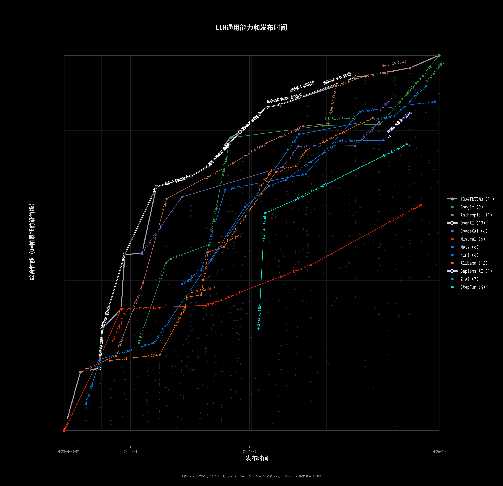

# LLM Leaderboard — 综合能力 vs 发布时间

## 全部模型（综合能力从高到低，最优 = 1，最差 = 0）

共收录 **Status: All**（含已弃用）的全部模型；按重新归一化后的综合能力排序。「帕累托」项：✅ = 总体帕累托前沿模型，❌ = 被支配。图表纵轴以总体帕累托前沿第一级（y0 = 0.0029，即前沿左端点 Mistral 7B）为 0：综合能力 ≥ 该级的 621 个模型入图，1 个能力低于第一级的不出现在图中；发布时间大于品牌前沿最大值的模型同样不入图（表列出全部模型）。

| # | 品牌 | 模型 | 综合能力 | 发布时间 | 横轴位置 | 帕累托 |
|---|------|------|---------|-----------|-----------|------|
| 1 |  Anthropic | Claude Fable 5.2 (max) | 1.0000 | 2026-11-09 | 1.0000 | ✅ |
| 2 |  Anthropic | Claude Fable 5.2 (xhigh) | 0.9781 | 2026-11-09 | 1.0000 | ❌ |
| 3 |  Google | Gemini 4 Carbon (high) | 0.9708 | 2026-10-28 | 0.9741 | ✅ |
| 4 |  Anthropic | Claude Fable 5.2 (high) | 0.9496 | 2026-11-09 | 1.0000 | ❌ |
| 5 |  Google | Gemini 4 Carbon (medium) | 0.9441 | 2026-10-28 | 0.9741 | ❌ |
| 6 |  OpenAI | GPT-5.6 Sol (max) | 0.9424 | 2026-07-09 | 0.7615 | ✅ |
| 7 |  Anthropic | Claude Opus 5.5 (max) | 0.9345 | 2026-09-22 | 0.9001 | ❌ |
| 8 |  Anthropic | Claude Opus 5 (xhigh) | 0.9244 | 2026-07-24 | 0.7876 | ❌ |
| 9 |  Anthropic | Claude Fable 5.1 (max) | 0.9166 | 2026-09-01 | 0.8592 | ❌ |
| 10 |  Anthropic | Claude Opus 5 (high) | 0.9165 | 2026-07-24 | 0.7876 | ❌ |
| 11 |  Anthropic | Claude Fable 5 | 0.9149 | 2026-06-09 | 0.7115 | ✅ |
| 12 |  OpenAI | GPT-6 Astra (xhigh) | 0.9148 | 2026-09-03 | 0.8631 | ❌ |
| 13 |  OpenAI | GPT-6 Astra (max) | 0.9138 | 2026-09-03 | 0.8631 | ❌ |
| 14 |  Anthropic | Claude Opus 5.5 (xhigh) | 0.9115 | 2026-09-22 | 0.9001 | ❌ |
| 15 |  Anthropic | Claude Fable 5.2 (medium) | 0.9075 | 2026-11-09 | 1.0000 | ❌ |
| 16 |  Anthropic | Claude Fable 5.1 (xhigh) | 0.9004 | 2026-09-01 | 0.8592 | ❌ |
| 17 |  OpenAI | GPT-6 Astra (high) | 0.8956 | 2026-09-03 | 0.8631 | ❌ |
| 18 |  Anthropic | Claude Sonnet 5.5 (max) | 0.8931 | 2026-09-28 | 0.9121 | ❌ |
| 19 |  Google | Gemini 4 Argon (high) | 0.8911 | 2026-09-30 | 0.9161 | ❌ |
| 20 |  Anthropic | Claude Fable 5.2 (low) | 0.8893 | 2026-11-09 | 1.0000 | ❌ |
| 21 |  OpenAI | GPT-5.6 Sol (xhigh) | 0.8843 | 2026-07-09 | 0.7615 | ❌ |
| 22 |  Meta | Muse Wonder Full (max) | 0.8817 | 2026-10-12 | 0.9406 | ❌ |
| 23 |  Anthropic | Claude Opus 5.5 (high) | 0.8753 | 2026-09-22 | 0.9001 | ❌ |
| 24 |  OpenAI | GPT-6.1 Sol (max) | 0.8740 | 2026-09-29 | 0.9141 | ❌ |
| 25 |  Anthropic | Claude Opus 5 (max) | 0.8727 | 2026-07-24 | 0.7876 | ❌ |
| 26 |  OpenAI | GPT-5.4 (xhigh) | 0.8684 | 2026-03-05 | 0.5696 | ✅ |
| 27 |  OpenAI | GPT-6 Astra (medium) | 0.8670 | 2026-09-03 | 0.8631 | ❌ |
| 28 |  OpenAI | GPT-5.5 (xhigh) | 0.8669 | 2026-04-23 | 0.6387 | ❌ |
| 29 |  Anthropic | Claude Fable 5.1 (high) | 0.8660 | 2026-09-01 | 0.8592 | ❌ |
| 30 |  OpenAI | GPT-6.1 Sol (xhigh) | 0.8634 | 2026-09-29 | 0.9141 | ❌ |
| 31 |  Anthropic | Claude Opus 5 (medium) | 0.8620 | 2026-07-24 | 0.7876 | ❌ |
| 32 |  OpenAI | GPT-5.6 Sol (high) | 0.8599 | 2026-07-09 | 0.7615 | ❌ |
| 33 |  Google | Gemini 4 Carbon (low) | 0.8570 | 2026-10-28 | 0.9741 | ❌ |
| 34 |  OpenAI | GPT-5.3 Codex (xhigh) | 0.8550 | 2026-02-05 | 0.5330 | ✅ |
| 35 |  Kimi | Kimi K3.1 Pro | 0.8508 | 2026-10-23 | 0.9636 | ❌ |
| 36 |  Kimi | Kimi K3 (max) | 0.8488 | 2026-07-16 | 0.7736 | ❌ |
| 37 |  OpenAI | GPT-6.1 Sol (high) | 0.8477 | 2026-09-29 | 0.9141 | ❌ |
| 38 |  Anthropic | Claude Opus 5.5 (medium) | 0.8406 | 2026-09-22 | 0.9001 | ❌ |
| 39 |  OpenAI | GPT-5.5 (high) | 0.8370 | 2026-04-23 | 0.6387 | ❌ |
| 40 |  OpenAI | GPT-5.6 Sol (medium) | 0.8329 | 2026-07-09 | 0.7615 | ❌ |
| 41 |  Alibaba | Qwen3.8 Max | 0.8296 | 2026-08-03 | 0.8055 | ❌ |
| 42 |  OpenAI | GPT-6.1 Terra (max) | 0.8284 | 2026-10-26 | 0.9699 | ❌ |
| 43 |  Anthropic | Claude Fable 5.1 (medium) | 0.8282 | 2026-09-01 | 0.8592 | ❌ |
| 44 |  OpenAI | GPT-6 Astra (low) | 0.8244 | 2026-09-03 | 0.8631 | ❌ |
| 45 |  Meta | Muse Spark 1.3 (xhigh) | 0.8237 | 2026-09-02 | 0.8612 | ❌ |
| 46 |  OpenAI | GPT-6.1 Sol (medium) | 0.8189 | 2026-09-29 | 0.9141 | ❌ |
| 47 |  SpaceXAI | Grok 4.6 (high) | 0.8186 | 2026-08-12 | 0.8218 | ❌ |
| 48 |  Anthropic | Claude Opus 4.8 (max) | 0.8169 | 2026-05-28 | 0.6923 | ❌ |
| 49 |  Meta | Muse Wonder (max) | 0.8156 | 2026-10-12 | 0.9406 | ❌ |
| 50 |  OpenAI | GPT-6 Sol (xhigh) | 0.8144 | 2026-09-22 | 0.9001 | ❌ |
| 51 |  Anthropic | Claude Opus 4.7 (max) | 0.8141 | 2026-04-16 | 0.6284 | ❌ |
| 52 |  Google | Gemini 3.7 Flash (medium) | 0.8140 | 2026-08-13 | 0.8237 | ❌ |
| 53 |  Google | Gemini 3.7 Flash (high) | 0.8112 | 2026-08-13 | 0.8237 | ❌ |
| 54 |  Google | Gemini 3.5 Flash (medium) | 0.8086 | 2026-05-19 | 0.6781 | ❌ |
| 55 |  Anthropic | Claude Sonnet 5.5 (xhigh) | 0.8023 | 2026-09-28 | 0.9121 | ❌ |
| 56 |  Anthropic | Claude Fable 5.1 (low) | 0.7981 | 2026-09-01 | 0.8592 | ❌ |
| 57 |  OpenAI | GPT-6 Sol (max) | 0.7976 | 2026-09-22 | 0.9001 | ❌ |
| 58 |  Meta | Muse Spark 1.3 (max) | 0.7915 | 2026-09-02 | 0.8612 | ❌ |
| 59 |  SpaceXAI | Grok 4.6 (medium) | 0.7901 | 2026-08-12 | 0.8218 | ❌ |
| 60 |  OpenAI | GPT-5.2 (xhigh) | 0.7897 | 2025-12-11 | 0.4654 | ✅ |
| 61 |  Alibaba | Qwen3.8 Max (0902) | 0.7894 | 2026-08-03 | 0.8055 | ❌ |
| 62 |  Meta | Muse Spark | 0.7888 | 2026-04-08 | 0.6169 | ❌ |
| 63 |  OpenAI | GPT-5.5 (medium) | 0.7886 | 2026-04-23 | 0.6387 | ❌ |
| 64 |  OpenAI | GPT-6.1 Terra (xhigh) | 0.7863 | 2026-10-26 | 0.9699 | ❌ |
| 65 |  OpenAI | GPT-6 Sol (high) | 0.7861 | 2026-09-22 | 0.9001 | ❌ |
| 66 |  OpenAI | GPT-5.6 Terra (max) | 0.7834 | 2026-07-09 | 0.7615 | ❌ |
| 67 |  Google | Gemini 3.5 Flash (high) | 0.7829 | 2026-05-19 | 0.6781 | ❌ |
| 68 |  Google | Gemini 3.8 Flash (high) | 0.7820 | 2026-09-02 | 0.8612 | ❌ |
| 69 |  OpenAI | GPT-5.2 Codex (xhigh) | 0.7800 | 2025-12-11 | 0.4654 | ❌ |
| 70 |  Sapiens AI | Agnes 2.5 Pro Beta | 0.7797 | 2026-08-26 | 0.8479 | ❌ |
| 71 |  Google | Gemini 3 Pro Preview (high) | 0.7766 | 2025-11-18 | 0.4397 | ✅ |
| 72 |  Anthropic | Claude Opus 5 (low) | 0.7727 | 2026-07-24 | 0.7876 | ❌ |
| 73 |  Anthropic | Claude Sonnet 5 (max) | 0.7723 | 2026-06-30 | 0.7462 | ❌ |
| 74 |  OpenAI | GPT-6.1 Terra (high) | 0.7643 | 2026-10-26 | 0.9699 | ❌ |
| 75 |  Z AI | GLM-5.3 (max) | 0.7635 | 2026-08-18 | 0.8329 | ❌ |
| 76 |  Anthropic | Claude Opus 4.6 (max) | 0.7633 | 2026-02-05 | 0.5330 | ❌ |
| 77 |  Google | Gemini 3.7 Flash (low) | 0.7618 | 2026-08-13 | 0.8237 | ❌ |
| 78 |  SpaceXAI | Grok 4.5 (high) | 0.7569 | 2026-07-08 | 0.7598 | ❌ |
| 79 |  SpaceXAI | Grok 4.20 0309 v2 | 0.7567 | 2026-04-07 | 0.6154 | ❌ |
| 80 |  OpenAI | GPT-6.1 Sol (low) | 0.7501 | 2026-09-29 | 0.9141 | ❌ |
| 81 |  Google | Gemini 3.1 Pro Preview | 0.7488 | 2026-02-19 | 0.5510 | ❌ |
| 82 |  StepFun | Step 5 Preview | 0.7485 | 2026-09-18 | 0.8922 | ❌ |
| 83 |  OpenAI | GPT-5.6 Sol (low) | 0.7479 | 2026-07-09 | 0.7615 | ❌ |
| 84 |  SpaceXAI | Grok 4.6 (xhigh) | 0.7459 | 2026-08-12 | 0.8218 | ❌ |
| 85 |  Alibaba | Qwen3.6 Max Preview | 0.7458 | 2026-04-20 | 0.6343 | ❌ |
| 86 |  OpenAI | GPT-6 Sol (medium) | 0.7447 | 2026-09-22 | 0.9001 | ❌ |
| 87 |  Meta | Muse Spark 1.2 (xhigh) | 0.7433 | 2026-08-05 | 0.8091 | ❌ |
| 88 |  Thinking Machines | Inkling 2 Small | 0.7404 | 2026-11-05 | 0.9913 | ❌ |
| 89 |  SpaceXAI | Grok 4.7 (xhigh) | 0.7396 | 2026-09-21 | 0.8981 | ❌ |
| 90 |  OpenAI | GPT-5.5 (low) | 0.7386 | 2026-04-23 | 0.6387 | ❌ |
| 91 |  Google | Gemini 3.8 Flash (medium) | 0.7385 | 2026-09-02 | 0.8612 | ❌ |
| 92 |  InclusionAI | Ling 3.1 Flash | 0.7369 | 2026-10-01 | 0.9181 | ❌ |
| 93 |  Alibaba | Qwen3.8 2.4T A95B | 0.7353 | 2026-08-12 | 0.8218 | ❌ |
| 94 |  SpaceXAI | Grok 4.3 (medium) | 0.7350 | 2026-04-30 | 0.6491 | ❌ |
| 95 |  SpaceXAI | Grok 4.7 (high) | 0.7343 | 2026-09-21 | 0.8981 | ❌ |
| 96 |  DeepSeek | DeepSeek V4 Flash 0731 (max) | 0.7307 | 2026-07-31 | 0.8001 | ❌ |
| 97 |  DeepSeek | DeepSeek V4.1 Flash (max) | 0.7290 | 2026-09-10 | 0.8766 | ❌ |
| 98 |  DeepSeek | DeepSeek V4 Pro (high) | 0.7265 | 2026-04-24 | 0.6402 | ❌ |
| 99 |  Z AI | GLM-5.2 (max) | 0.7264 | 2026-06-16 | 0.7229 | ❌ |
| 100 |  DeepSeek | DeepSeek V4 Flash Vision (max) | 0.7255 | 2026-08-21 | 0.8385 | ❌ |
| 101 |  Anthropic | Claude Opus 5.5 (low) | 0.7243 | 2026-09-22 | 0.9001 | ❌ |
| 102 |  OpenAI | GPT-5.6 Luna (xhigh) | 0.7209 | 2026-07-09 | 0.7615 | ❌ |
| 103 |  OpenAI | GPT-5.4 (low) | 0.7196 | 2026-03-05 | 0.5696 | ❌ |
| 104 |  Meta | Muse Wonder (high) | 0.7178 | 2026-10-12 | 0.9406 | ❌ |
| 105 |  Google | Gemini 3 Flash | 0.7176 | 2025-12-17 | 0.4723 | ❌ |
| 106 |  OpenAI | GPT-6.1 Terra (medium) | 0.7176 | 2026-10-26 | 0.9699 | ❌ |
| 107 |  Anthropic | Claude Sonnet 5.5 (high) | 0.7150 | 2026-09-28 | 0.9121 | ❌ |
| 108 |  Anthropic | Claude Opus 4.5 | 0.7134 | 2025-11-24 | 0.4463 | ❌ |
| 109 |  Google | Gemini 3.6 Flash (high) | 0.7124 | 2026-07-21 | 0.7824 | ❌ |
| 110 |  OpenAI | GPT-5.6 Terra (xhigh) | 0.7121 | 2026-07-09 | 0.7615 | ❌ |
| 111 |  Anthropic | Claude Haiku 5.5 (max) | 0.7104 | 2026-10-07 | 0.9303 | ❌ |
| 112 |  Alibaba | Qwen3.6 Plus | 0.7104 | 2026-04-02 | 0.6083 | ❌ |
| 113 |  Meta | Muse Spark 1.1 (xhigh) | 0.7084 | 2026-07-09 | 0.7615 | ❌ |
| 114 |  Z AI | GLM-5.3-Flash | 0.7066 | 2026-08-26 | 0.8479 | ❌ |
| 115 |  OpenAI | GPT-5 Codex (high) | 0.7060 | 2025-09-23 | 0.3818 | ✅ |
| 116 |  SpaceXAI | Grok 4.20 0309 | 0.7040 | 2026-03-10 | 0.5764 | ❌ |
| 117 |  Meta | Muse Spark Open (xhigh) | 0.7038 | 2026-10-15 | 0.9468 | ❌ |
| 118 |  Alibaba | Qwen3.8-Flash-Next | 0.6990 | 2026-08-26 | 0.8479 | ❌ |
| 119 |  Alibaba | Qwen3.5 27B | 0.6947 | 2026-02-24 | 0.5576 | ❌ |
| 120 |  OpenAI | GPT-5.2 (medium) | 0.6938 | 2025-12-11 | 0.4654 | ❌ |
| 121 |  Anthropic | Claude Opus 4.7 (non-reasoning, high) | 0.6922 | 2026-04-16 | 0.6284 | ❌ |
| 122 |  DeepSeek | DeepSeek V4.1 Flash 1017 (max) | 0.6900 | 2026-10-17 | 0.9510 | ❌ |
| 123 |  Motif Technologies | Motif 3 (Beta) | 0.6895 | 2026-07-14 | 0.7701 | ❌ |
| 124 |  Nex AGI | Nex-N2-Pro | 0.6881 | 2026-06-02 | 0.7002 | ❌ |
| 125 |  Kimi | Kimi K2.6 | 0.6878 | 2026-04-20 | 0.6343 | ❌ |
| 126 |  Motif Technologies | Motif 3 | 0.6854 | 2026-08-12 | 0.8218 | ❌ |
| 127 |  OpenAI | GPT-5 (medium) | 0.6820 | 2025-08-07 | 0.3377 | ✅ |
| 128 |  DeepSeek | DeepSeek V4 Pro (max) | 0.6813 | 2026-04-24 | 0.6402 | ❌ |
| 129 |  OpenAI | GPT-5.1 Codex (high) | 0.6813 | 2025-11-13 | 0.4343 | ❌ |
| 130 |  Alibaba | Qwen3.7 Max | 0.6805 | 2026-05-19 | 0.6781 | ❌ |
| 131 |  Xiaomi | MiMo-V2.6-Pro | 0.6789 | 2026-09-21 | 0.8981 | ❌ |
| 132 |  OpenAI | GPT-5.6 Luna (high) | 0.6780 | 2026-07-09 | 0.7615 | ❌ |
| 133 |  Xiaomi | MiMo-V2-Pro | 0.6770 | 2026-03-18 | 0.5873 | ❌ |
| 134 |  SpaceXAI | Grok 4.7 (low) | 0.6717 | 2026-09-21 | 0.8981 | ❌ |
| 135 |  OpenAI | GPT-5.6 Terra (high) | 0.6717 | 2026-07-09 | 0.7615 | ❌ |
| 136 |  InclusionAI | Ling 3.1 Flash 1019 | 0.6715 | 2026-10-22 | 0.9614 | ❌ |
| 137 |  Z AI | GLM-5-Turbo | 0.6700 | 2026-03-15 | 0.5832 | ❌ |
| 138 |  OpenAI | GPT-5.1 (high) | 0.6696 | 2025-11-13 | 0.4343 | ❌ |
| 139 |  Xiaomi | MiMo-V2-Omni-0327 | 0.6677 | 2026-03-27 | 0.5998 | ❌ |
| 140 |  SpaceXAI | Grok 4.3 (low) | 0.6642 | 2026-04-30 | 0.6491 | ❌ |
| 141 |  Anthropic | Claude Haiku 5.5 (xhigh) | 0.6561 | 2026-10-07 | 0.9303 | ❌ |
| 142 |  MiniMax | MiniMax-M2.5 | 0.6560 | 2026-02-12 | 0.5419 | ❌ |
| 143 |  OpenAI | o3 | 0.6552 | 2025-04-16 | 0.2470 | ✅ |
| 144 |  Anthropic | Claude Sonnet 4.6 (max) | 0.6547 | 2026-02-17 | 0.5484 | ❌ |
| 145 |  Z AI | GLM-5 | 0.6534 | 2026-02-11 | 0.5407 | ❌ |
| 146 |  Alibaba | Qwen3.7 Plus | 0.6520 | 2026-06-01 | 0.6986 | ❌ |
| 147 |  Tencent | Hy3-preview | 0.6496 | 2026-04-23 | 0.6387 | ❌ |
| 148 |  OpenAI | GPT-5.6 Luna (max) | 0.6492 | 2026-07-09 | 0.7615 | ❌ |
| 149 |  Xiaomi | MiMo-V2-Flash (Feb 2026) | 0.6489 | 2025-12-16 | 0.4711 | ❌ |
| 150 |  Kimi | Kimi K2.7 Code | 0.6480 | 2026-06-12 | 0.7163 | ❌ |
| 151 |  OpenAI | GPT-5 (high) | 0.6463 | 2025-08-07 | 0.3377 | ❌ |
| 152 |  OpenAI | GPT-6 Sol (low) | 0.6442 | 2026-09-22 | 0.9001 | ❌ |
| 153 |  Kimi | Kimi K2 Thinking | 0.6442 | 2025-11-06 | 0.4268 | ❌ |
| 154 |  OpenAI | GPT-5.4 mini (xhigh) | 0.6430 | 2026-03-17 | 0.5859 | ❌ |
| 155 |  SpaceXAI | Grok 4.6 (low) | 0.6427 | 2026-08-12 | 0.8218 | ❌ |
| 156 |  SpaceXAI | Grok Build 0.1 0616 | 0.6418 | 2026-06-16 | 0.7229 | ❌ |
| 157 |  Google | Gemini 3.8 Flash (low) | 0.6412 | 2026-09-02 | 0.8612 | ❌ |
| 158 |  OpenAI | GPT-6.1 Terra (low) | 0.6406 | 2026-10-26 | 0.9699 | ❌ |
| 159 |  Z AI | GLM 5V Turbo | 0.6377 | 2026-04-01 | 0.6069 | ❌ |
| 160 |  DeepSeek | DeepSeek V4 Flash (max) | 0.6371 | 2026-04-24 | 0.6402 | ❌ |
| 161 |  Xiaomi | MiMo-V2-Flash | 0.6360 | 2025-12-16 | 0.4711 | ❌ |
| 162 |  Xiaomi | MiMo-V2-Omni | 0.6341 | 2026-03-19 | 0.5887 | ❌ |
| 163 |  Z AI | GLM-5.1 | 0.6336 | 2026-04-07 | 0.6154 | ❌ |
| 164 |  Anthropic | Claude Sonnet 5.5 (medium) | 0.6322 | 2026-09-28 | 0.9121 | ❌ |
| 165 |  Alibaba | Qwen3 Max Thinking | 0.6320 | 2026-01-26 | 0.5204 | ❌ |
| 166 |  Anthropic | Claude Opus 4.6 (non-reasoning, high) | 0.6316 | 2026-02-05 | 0.5330 | ❌ |
| 167 |  Anthropic | Claude 4 Opus | 0.6252 | 2025-05-22 | 0.2738 | ❌ |
| 168 |  SpaceXAI | Grok 4 | 0.6245 | 2025-07-10 | 0.3134 | ❌ |
| 169 |  Alibaba | Qwen3.8 27B (xhigh) | 0.6244 | 2026-08-14 | 0.8255 | ❌ |
| 170 |  DeepSeek | DeepSeek V4 Pro 0813 (max) | 0.6230 | 2026-08-13 | 0.8237 | ❌ |
| 171 |  Alibaba | Qwen3.5 35B A3B | 0.6213 | 2026-02-24 | 0.5576 | ❌ |
| 172 |  MiniMax | MiniMax-M3.1-Flash | 0.6198 | 2026-10-19 | 0.9551 | ❌ |
| 173 |  StepFun | Step 3.5 Flash 2603 | 0.6167 | 2026-04-02 | 0.6083 | ❌ |
| 174 |  OpenAI | GPT-5.4 nano (xhigh) | 0.6162 | 2026-03-17 | 0.5859 | ❌ |
| 175 |  Kimi | Kimi K2.5 | 0.6139 | 2026-01-27 | 0.5216 | ❌ |
| 176 |  OpenAI | GPT-5.6 Sol (non-reasoning) | 0.6137 | 2026-07-09 | 0.7615 | ❌ |
| 177 |  DeepSeek | DeepSeek V4 Flash (high) | 0.6134 | 2026-04-24 | 0.6402 | ❌ |
| 178 |  Anthropic | Claude Sonnet 5 (xhigh) | 0.6131 | 2026-06-30 | 0.7462 | ❌ |
| 179 |  MiniMax | MiniMax-M2.1 | 0.6090 | 2025-12-23 | 0.4793 | ❌ |
| 180 |  OpenAI | GPT-5.6 Terra (medium) | 0.6062 | 2026-07-09 | 0.7615 | ❌ |
| 181 |  OpenAI | GPT-5 mini (medium) | 0.6061 | 2025-08-07 | 0.3377 | ❌ |
| 182 |  OpenAI | GPT-6 Luna (max) | 0.6047 | 2026-09-22 | 0.9001 | ❌ |
| 183 |  SpaceXAI | Grok 4.1 Fast | 0.6038 | 2025-11-19 | 0.4408 | ❌ |
| 184 |  Google | Gemini 3.5 Flash (minimal) | 0.6022 | 2026-05-19 | 0.6781 | ❌ |
| 185 |  China Mobile | JT-4.1 Flash 236B A21B | 0.6003 | 2026-07-09 | 0.7615 | ❌ |
| 186 |  Z AI | GLM-4.7 | 0.6002 | 2025-12-22 | 0.4781 | ❌ |
| 187 |  Xiaomi | MiMo-V2.5 | 0.5999 | 2026-04-22 | 0.6372 | ❌ |
| 188 |  KwaiKAT | KAT-Coder-Pro V2 | 0.5998 | 2026-03-27 | 0.5998 | ❌ |
| 189 |  InclusionAI | Ling-3.0-flash-VL | 0.5971 | 2026-09-10 | 0.8766 | ❌ |
| 190 |  Anthropic | Claude Haiku 5.5 (high) | 0.5969 | 2026-10-07 | 0.9303 | ❌ |
| 191 |  Alibaba | Qwen3.5 397B A17B | 0.5967 | 2026-02-16 | 0.5471 | ❌ |
| 192 |  OpenAI | GPT-5.5 Instant (May 2026) | 0.5949 | 2026-05-05 | 0.6567 | ❌ |
| 193 |  Alibaba | Qwen3.6 27B | 0.5947 | 2026-04-22 | 0.6372 | ❌ |
| 194 |  Anthropic | Claude Sonnet 5 (non-reasoning) | 0.5925 | 2026-06-30 | 0.7462 | ❌ |
| 195 |  Anthropic | Claude Opus 4.5 (non-reasoning) | 0.5909 | 2025-11-24 | 0.4463 | ❌ |
| 196 |  OpenAI | GPT-5 (low) | 0.5906 | 2025-08-07 | 0.3377 | ❌ |
| 197 |  OpenAI | GPT-5.1 Codex mini (high) | 0.5898 | 2025-11-13 | 0.4343 | ❌ |
| 198 |  Anthropic | Claude Sonnet 5 (high) | 0.5895 | 2026-06-30 | 0.7462 | ❌ |
| 199 |  Z AI | GLM-5.1 (non-reasoning) | 0.5889 | 2026-04-07 | 0.6154 | ❌ |
| 200 |  Mistral | Mistral Large 4 Preview | 0.5885 | 2026-10-06 | 0.9283 | ❌ |
| 201 |  Kimi | Kimi K3 (low) | 0.5875 | 2026-07-16 | 0.7736 | ❌ |
| 202 |  StepFun | Step 3.7 Flash | 0.5866 | 2026-05-29 | 0.6938 | ❌ |
| 203 |  China Mobile | JT-4.1 Flash 236B A21B (non-reasoning) | 0.5860 | 2026-07-09 | 0.7615 | ❌ |
| 204 |  Anthropic | Claude Sonnet 4.6 (non-reasoning, high) | 0.5849 | 2026-02-17 | 0.5484 | ❌ |
| 205 |  SpaceXAI | Grok 4.3 (high) | 0.5839 | 2026-04-30 | 0.6491 | ❌ |
| 206 |  Sapiens AI | Agnes 2.5 Pro Theta | 0.5834 | 2026-11-07 | 0.9956 | ❌ |
| 207 |  Google | Gemini 3 Pro Preview (low) | 0.5827 | 2025-11-18 | 0.4397 | ❌ |
| 208 |  DeepSeek | DeepSeek V3.2 | 0.5821 | 2025-12-01 | 0.4541 | ❌ |
| 209 |  StepFun | Step 3.5 Flash | 0.5813 | 2026-02-02 | 0.5292 | ❌ |
| 210 |  Upstage | Solar Open2 250B | 0.5812 | 2026-08-12 | 0.8218 | ❌ |
| 211 |  Xiaomi | MiMo-V2.5-Pro | 0.5804 | 2026-04-22 | 0.6372 | ❌ |
| 212 |  Meta | Muse Ember (max) | 0.5802 | 2026-11-09 | 1.0000 | ❌ |
| 213 |  Kimi | Kimi K2.6 (non-reasoning) | 0.5799 | 2026-04-20 | 0.6343 | ❌ |
| 214 |  Anthropic | Claude 4.1 Opus | 0.5798 | 2025-08-05 | 0.3360 | ❌ |
| 215 |  Alibaba | Qwen3.5 122B A10B | 0.5751 | 2026-02-24 | 0.5576 | ❌ |
| 216 |  MiniMax | MiniMax-M2 | 0.5749 | 2025-10-26 | 0.4151 | ❌ |
| 217 |  Anthropic | Claude Sonnet 5.5 (low) | 0.5745 | 2026-09-28 | 0.9121 | ❌ |
| 218 |  Alibaba | Qwen3.5 27B (non-reasoning) | 0.5743 | 2026-02-24 | 0.5576 | ❌ |
| 219 |  MiniMax | MiniMax-M3 | 0.5731 | 2026-06-01 | 0.6986 | ❌ |
| 220 |  Anthropic | Claude Sonnet 4.6 (non-reasoning, low) | 0.5728 | 2026-02-17 | 0.5484 | ❌ |
| 221 |  Tencent | Hy3 | 0.5717 | 2026-07-06 | 0.7564 | ❌ |
| 222 |  Alibaba | Qwen3.5 397B A17B (non-reasoning) | 0.5715 | 2026-02-16 | 0.5471 | ❌ |
| 223 |  Xiaomi | MiMo-V2.6-Flash | 0.5693 | 2026-09-21 | 0.8981 | ❌ |
| 224 |  OpenAI | GPT-5.4 mini (medium) | 0.5653 | 2026-03-17 | 0.5859 | ❌ |
| 225 |  Alibaba | Qwen3.5 Omni Plus | 0.5622 | 2026-03-30 | 0.6040 | ❌ |
| 226 |  Multiverse Computing | Quasar 438B (max) | 0.5621 | 2026-08-10 | 0.8182 | ❌ |
| 227 |  Anthropic | Claude 4.5 Sonnet | 0.5600 | 2025-09-29 | 0.3877 | ❌ |
| 228 |  OpenAI | GPT-5.4 nano (medium) | 0.5582 | 2026-03-17 | 0.5859 | ❌ |
| 229 |  Meta | Muse Ember (xhigh) | 0.5561 | 2026-11-09 | 1.0000 | ❌ |
| 230 |  OpenAI | GPT-5.6 Luna (medium) | 0.5557 | 2026-07-09 | 0.7615 | ❌ |
| 231 |  OpenAI | GPT-5.6 Terra (low) | 0.5532 | 2026-07-09 | 0.7615 | ❌ |
| 232 |  Amazon | Nova 2.0 Pro Preview (medium) | 0.5519 | 2025-11-27 | 0.4496 | ❌ |
| 233 |  Institute of Foundation Models | K2 Horizon 375B A23B | 0.5489 | 2026-09-03 | 0.8631 | ❌ |
| 234 |  SpaceXAI | Grok 4 Fast | 0.5441 | 2025-09-19 | 0.3778 | ❌ |
| 235 |  Alibaba | Qwen3.6 35B A3B | 0.5433 | 2026-04-16 | 0.6284 | ❌ |
| 236 |  Anthropic | Claude Haiku 5.5 (medium) | 0.5432 | 2026-10-07 | 0.9303 | ❌ |
| 237 |  OpenAI | GPT-6 Luna (xhigh) | 0.5410 | 2026-09-22 | 0.9001 | ❌ |
| 238 |  Upstage | Solar Pro 4 | 0.5402 | 2026-08-06 | 0.8109 | ❌ |
| 239 |  Alibaba | Qwen3.6 27B (non-reasoning) | 0.5397 | 2026-04-22 | 0.6372 | ❌ |
| 240 |  DeepSeek | DeepSeek V4.1 Flash 1017 (high) | 0.5342 | 2026-10-17 | 0.9510 | ❌ |
| 241 |  Kimi | Kimi K2.5 (non-reasoning) | 0.5337 | 2026-01-27 | 0.5216 | ❌ |
| 242 |  Google | Gemini 3 Flash (non-reasoning) | 0.5317 | 2025-12-17 | 0.4723 | ❌ |
| 243 |  Alibaba | Qwen3.5 122B A10B (non-reasoning) | 0.5294 | 2026-02-24 | 0.5576 | ❌ |
| 244 |  OpenAI | GPT-5.5 (non-reasoning) | 0.5292 | 2026-04-23 | 0.6387 | ❌ |
| 245 |  DeepSeek | DeepSeek V3.2 Speciale | 0.5272 | 2025-12-01 | 0.4541 | ❌ |
| 246 |  OpenAI | o4-mini (high) | 0.5269 | 2025-04-16 | 0.2470 | ❌ |
| 247 |  Amazon | Nova 2.0 Lite (medium) | 0.5264 | 2025-10-29 | 0.4183 | ❌ |
| 248 |  ByteDance Seed | Doubao Seed Code | 0.5264 | 2025-11-11 | 0.4321 | ❌ |
| 249 |  Z AI | GLM-5.3 (low) | 0.5264 | 2026-08-18 | 0.8329 | ❌ |
| 250 |  China Mobile | JT-35B-Flash | 0.5260 | 2026-05-14 | 0.6704 | ❌ |
| 251 |  MiniMax | MiniMax-M2.7 | 0.5242 | 2026-03-18 | 0.5873 | ❌ |
| 252 |  Institute of Foundation Models | K2 Horizon MoVA 36B A4B | 0.5239 | 2026-09-03 | 0.8631 | ❌ |
| 253 |  KwaiKAT | KAT-Coder-Pro V1 | 0.5197 | 2025-11-11 | 0.4321 | ❌ |
| 254 |  Apodex | Apodex 1.1 | 0.5186 | 2026-08-30 | 0.8554 | ❌ |
| 255 |  NVIDIA | Nemotron 3 Ultra | 0.5175 | 2026-06-04 | 0.7034 | ❌ |
| 256 |  Thinking Machines | Inkling (xhigh) | 0.5174 | 2026-07-15 | 0.7719 | ❌ |
| 257 |  OpenAI | GPT-6 Luna (high) | 0.5171 | 2026-09-22 | 0.9001 | ❌ |
| 258 |  Thinking Machines | Inkling Small | 0.5144 | 2026-07-30 | 0.7983 | ❌ |
| 259 |  OpenAI | GPT-6.1 Terra (non-reasoning) | 0.5132 | 2026-10-26 | 0.9699 | ❌ |
| 260 |  Amazon | Nova 2.0 Pro Preview (low) | 0.5116 | 2025-11-27 | 0.4496 | ❌ |
| 261 |  Z AI | GLM-5 (non-reasoning) | 0.5108 | 2026-02-11 | 0.5407 | ❌ |
| 262 |  Anthropic | Claude Sonnet 5 (medium) | 0.5086 | 2026-06-30 | 0.7462 | ❌ |
| 263 |  OpenAI | GPT-6 Sol (non-reasoning) | 0.5083 | 2026-09-22 | 0.9001 | ❌ |
| 264 |  InclusionAI | Ling 3.0 Flash | 0.5064 | 2026-08-04 | 0.8073 | ❌ |
| 265 |  Amazon | Nova 2.0 Omni (low) | 0.5055 | 2025-11-26 | 0.4485 | ❌ |
| 266 |  DeepSeek | DeepSeek V4 Pro (non-reasoning) | 0.5039 | 2026-04-24 | 0.6402 | ❌ |
| 267 |  Reflection | Beam 1.0 | 0.5034 | 2026-10-16 | 0.9489 | ❌ |
| 268 |  Google | Gemini 2.5 Flash (Sep) | 0.5017 | 2025-09-25 | 0.3837 | ❌ |
| 269 |  Alibaba | Qwen3.8 27B (medium) | 0.5013 | 2026-08-14 | 0.8255 | ❌ |
| 270 |  Anthropic | Claude 4 Sonnet | 0.5002 | 2025-05-22 | 0.2738 | ❌ |
| 271 |  InclusionAI | Ling-2.6-1T | 0.4979 | 2026-04-23 | 0.6387 | ❌ |
| 272 |  Alibaba | Qwen3 Max Thinking (Preview) | 0.4965 | 2025-11-03 | 0.4236 | ❌ |
| 273 |  Google | Gemini 3.5 Flash-Lite | 0.4961 | 2026-07-21 | 0.7824 | ❌ |
| 274 |  Alibaba | Qwen3.8 27B (low) | 0.4956 | 2026-08-14 | 0.8255 | ❌ |
| 275 |  OpenAI | GPT-5.6 Luna (low) | 0.4949 | 2026-07-09 | 0.7615 | ❌ |
| 276 |  Amazon | Nova 2.0 Omni (medium) | 0.4937 | 2025-11-26 | 0.4485 | ❌ |
| 277 |  OpenAI | GPT-5 mini (high) | 0.4929 | 2025-08-07 | 0.3377 | ❌ |
| 278 |  Alibaba | Qwen3.6 35B A3B (non-reasoning) | 0.4908 | 2026-04-16 | 0.6284 | ❌ |
| 279 |  InclusionAI | Ling-3.0-flash-Fin | 0.4905 | 2026-09-11 | 0.8785 | ❌ |
| 280 |  Baidu | ERNIE 5.0 Thinking Preview | 0.4905 | 2025-11-13 | 0.4343 | ❌ |
| 281 |  OpenAI | GPT-5.4 (non-reasoning) | 0.4896 | 2026-03-05 | 0.5696 | ❌ |
| 282 |  Anthropic | Claude Haiku 5.5 (low) | 0.4878 | 2026-10-07 | 0.9303 | ❌ |
| 283 |  SK Telecom | A.X-K2 | 0.4860 | 2026-08-12 | 0.8218 | ❌ |
| 284 |  Google | Gemma 4 26B A4B | 0.4852 | 2026-04-02 | 0.6083 | ❌ |
| 285 |  LG AI Research | K-EXAONE | 0.4851 | 2025-12-31 | 0.4887 | ❌ |
| 286 |  AI9Stars | G9v3-39A5B | 0.4847 | 2026-08-20 | 0.8366 | ❌ |
| 287 |  LG AI Research | EXAONE 4.5 33B | 0.4846 | 2026-04-09 | 0.6183 | ❌ |
| 288 |  DeepSeek | DeepSeek V3.2 Exp | 0.4838 | 2025-09-29 | 0.3877 | ❌ |
| 289 |  OpenAI | GPT-6 Luna (medium) | 0.4836 | 2026-09-22 | 0.9001 | ❌ |
| 290 |  Amazon | Nova 2.0 Lite (high) | 0.4830 | 2025-10-29 | 0.4183 | ❌ |
| 291 |  Alibaba | Qwen3 VL 235B A22B | 0.4823 | 2025-09-23 | 0.3818 | ❌ |
| 292 |  DeepSeek | DeepSeek V4 Flash (non-reasoning) | 0.4823 | 2026-04-24 | 0.6402 | ❌ |
| 293 |  DeepSeek | DeepSeek V3.2 (non-reasoning) | 0.4813 | 2025-12-01 | 0.4541 | ❌ |
| 294 |  SpaceXAI | Grok 3 mini Reasoning (high) | 0.4790 | 2025-02-19 | 0.2089 | ✅ |
| 295 |  OpenAI | o1 | 0.4775 | 2024-12-05 | 0.1633 | ✅ |
| 296 |  Anthropic | Claude 4.5 Sonnet (non-reasoning) | 0.4772 | 2025-09-29 | 0.3877 | ❌ |
| 297 |  Google | Gemma 4 12B | 0.4761 | 2026-06-03 | 0.7018 | ❌ |
| 298 |  Tencent | Tencent Hy4 | 0.4753 | 2026-11-03 | 0.9870 | ❌ |
| 299 |  Z AI | GLM-4.7 (non-reasoning) | 0.4733 | 2025-12-22 | 0.4781 | ❌ |
| 300 |  Xiaomi | MiMo-V2.5-Pro (non-reasoning) | 0.4678 | 2026-04-22 | 0.6372 | ❌ |
| 301 |  SpaceXAI | Grok 4.20 0309 (non-reasoning) | 0.4665 | 2026-03-10 | 0.5764 | ❌ |
| 302 |  Alibaba | Qwen3.5 35B A3B (non-reasoning) | 0.4650 | 2026-02-24 | 0.5576 | ❌ |
| 303 |  Z AI | GLM-4.7-Flash | 0.4648 | 2026-01-19 | 0.5117 | ❌ |
| 304 |  Alibaba | Qwen3.5 4B | 0.4627 | 2026-03-02 | 0.5656 | ❌ |
| 305 |  Google | Gemini 2.5 Pro | 0.4624 | 2025-06-05 | 0.2847 | ❌ |
| 306 |  Z AI | GLM-4.6 | 0.4614 | 2025-09-30 | 0.3887 | ❌ |
| 307 |  Alibaba | Qwen3.5 9B | 0.4574 | 2026-03-02 | 0.5656 | ❌ |
| 308 |  NVIDIA | Nemotron 3.5 Super VL | 0.4563 | 2026-10-15 | 0.9468 | ❌ |
| 309 |  Google | Gemini 2.5 Flash | 0.4540 | 2025-05-20 | 0.2722 | ❌ |
| 310 |  Google | Gemma 4 31B (non-reasoning) | 0.4511 | 2026-04-02 | 0.6083 | ❌ |
| 311 |  Xiaomi | MiMo-V2-Flash (non-reasoning) | 0.4500 | 2025-12-16 | 0.4711 | ❌ |
| 312 |  Google | Gemma 4 31B | 0.4493 | 2026-04-02 | 0.6083 | ❌ |
| 313 |  SpaceXAI | Grok 4.20 0309 v2 (non-reasoning) | 0.4490 | 2026-04-07 | 0.6154 | ❌ |
| 314 |  DeepSeek | DeepSeek V3.1 Terminus | 0.4485 | 2025-09-22 | 0.3808 | ❌ |
| 315 |  ServiceNow | Apriel-v1.6-15B-Thinker | 0.4464 | 2025-11-25 | 0.4474 | ❌ |
| 316 |  LongCat | LongCat 2.0 | 0.4463 | 2026-06-29 | 0.7445 | ❌ |
| 317 |  InclusionAI | Ring-2.6-1T | 0.4444 | 2026-05-08 | 0.6612 | ❌ |
| 318 |  Alibaba | Qwen3.5 9B (non-reasoning) | 0.4440 | 2026-03-02 | 0.5656 | ❌ |
| 319 |  Alibaba | Qwen3.8 27B (non-reasoning) | 0.4438 | 2026-08-14 | 0.8255 | ❌ |
| 320 |  Upstage | Solar Mini 4 | 0.4436 | 2026-09-22 | 0.9001 | ❌ |
| 321 |  Alibaba | Qwen3.5 Omni Flash | 0.4431 | 2026-03-30 | 0.6040 | ❌ |
| 322 |  Anthropic | Claude Sonnet 5 (low) | 0.4422 | 2026-06-30 | 0.7462 | ❌ |
| 323 |  Mistral | Mistral Large 4 (high) | 0.4416 | 2026-10-29 | 0.9763 | ❌ |
| 324 |  Alibaba | Qwen3 Max | 0.4408 | 2025-09-23 | 0.3818 | ❌ |
| 325 |  OpenAI | GPT-5.5 Instant (June 2026) | 0.4395 | 2026-06-25 | 0.7378 | ❌ |
| 326 |  Z AI | GLM-5.2 (non-reasoning) | 0.4392 | 2026-06-16 | 0.7229 | ❌ |
| 327 |  Amazon | Nova 2.0 Lite (low) | 0.4383 | 2025-10-29 | 0.4183 | ❌ |
| 328 |  Tencent | Hy3-preview (non-reasoning) | 0.4362 | 2026-04-23 | 0.6387 | ❌ |
| 329 |  Kimi | Kimi K2 0905 | 0.4351 | 2025-09-05 | 0.3644 | ❌ |
| 330 |  Alibaba | Qwen3 VL 32B | 0.4347 | 2025-10-21 | 0.4099 | ❌ |
| 331 |  Nanbeige | Nanbeige4.3-33B | 0.4343 | 2026-10-25 | 0.9678 | ❌ |
| 332 |  Institute of Foundation Models | K2 Horizon 7B | 0.4334 | 2026-09-03 | 0.8631 | ❌ |
| 333 |  Mistral | Mistral Large 4 (medium) | 0.4293 | 2026-10-29 | 0.9763 | ❌ |
| 334 |  Meta | Muse Glimmer (high) | 0.4253 | 2026-08-10 | 0.8182 | ❌ |
| 335 |  NVIDIA | Nemotron Cascade 2 30B A3B | 0.4239 | 2026-03-19 | 0.5887 | ❌ |
| 336 |  Anthropic | Claude 4 Sonnet (non-reasoning) | 0.4236 | 2025-05-22 | 0.2738 | ❌ |
| 337 |  Cohere | Command A+ | 0.4232 | 2026-05-20 | 0.6797 | ❌ |
| 338 |  Google | Gemma 4 26B A4B (non-reasoning) | 0.4218 | 2026-04-02 | 0.6083 | ❌ |
| 339 |  Mistral | Mistral Medium 3.5 | 0.4210 | 2026-04-29 | 0.6476 | ❌ |
| 340 |  OpenAI | GPT-5.2 (non-reasoning) | 0.4204 | 2025-12-11 | 0.4654 | ❌ |
| 341 |  SpaceXAI | Grok Code Fast 1 | 0.4194 | 2025-08-28 | 0.3569 | ❌ |
| 342 |  Google | Gemini 2.5 Flash-Lite (Sep) | 0.4190 | 2025-09-25 | 0.3837 | ❌ |
| 343 |  Anthropic | Claude 4.5 Haiku | 0.4180 | 2025-10-15 | 0.4038 | ❌ |
| 344 |  ServiceNow | Apriel-v1.5-15B-Thinker | 0.4171 | 2025-09-30 | 0.3887 | ❌ |
| 345 |  Google | Gemini 2.5 Flash (Sep) (non-reasoning) | 0.4161 | 2025-09-25 | 0.3837 | ❌ |
| 346 |  OpenAI | GPT-5 nano (high) | 0.4160 | 2025-08-07 | 0.3377 | ❌ |
| 347 |  DeepSeek | DeepSeek V3.1 | 0.4150 | 2025-08-21 | 0.3504 | ❌ |
| 348 |  Inception | Mercury 2 | 0.4121 | 2026-02-20 | 0.5524 | ❌ |
| 349 |  OpenAI | GPT-4.1 | 0.4112 | 2025-04-14 | 0.2455 | ❌ |
| 350 |  OpenAI | GPT-5 (minimal) | 0.4082 | 2025-08-07 | 0.3377 | ❌ |
| 351 |  DeepSeek | DeepSeek V4.1 Flash (non-reasoning) | 0.4055 | 2026-09-10 | 0.8766 | ❌ |
| 352 |  OpenAI | GPT-5 nano (medium) | 0.4054 | 2025-08-07 | 0.3377 | ❌ |
| 353 |  NVIDIA | Nemotron 3.5 Bolt 74B-A9B | 0.4052 | 2026-10-15 | 0.9468 | ❌ |
| 354 |  OpenAI | GPT-5.6 Terra (non-reasoning) | 0.4051 | 2026-07-09 | 0.7615 | ❌ |
| 355 |  Z AI | GLM-4.5 | 0.4038 | 2025-07-28 | 0.3289 | ❌ |
| 356 |  Anthropic | Claude 3.7 Sonnet (non-reasoning) | 0.4032 | 2025-02-24 | 0.2121 | ❌ |
| 357 |  DeepSeek | DeepSeek V4.1 Flash 1017 (non-reasoning) | 0.4022 | 2026-10-17 | 0.9510 | ❌ |
| 358 |  OpenAI | GPT-6 Luna (low) | 0.3992 | 2026-09-22 | 0.9001 | ❌ |
| 359 |  Kimi | Kimi K2 | 0.3979 | 2025-07-11 | 0.3142 | ❌ |
| 360 |  OpenAI | GPT-5.1 (non-reasoning) | 0.3937 | 2025-11-13 | 0.4343 | ❌ |
| 361 |  NVIDIA | Nemotron 3 Super | 0.3933 | 2026-03-11 | 0.5777 | ❌ |
| 362 |  DeepSeek | DeepSeek R1 0528 | 0.3924 | 2025-05-28 | 0.2784 | ❌ |
| 363 |  Anthropic | Claude 3.7 Sonnet | 0.3913 | 2025-02-24 | 0.2121 | ❌ |
| 364 |  DeepSeek | DeepSeek V3.1 Terminus (non-reasoning) | 0.3832 | 2025-09-22 | 0.3808 | ❌ |
| 365 |  Arcee AI | Trinity Large Thinking | 0.3822 | 2026-04-01 | 0.6069 | ❌ |
| 366 |  LG AI Research | K-EXAONE 2.0 | 0.3818 | 2026-08-12 | 0.8218 | ❌ |
| 367 |  SpaceXAI | Grok 4.3 (non-reasoning) | 0.3807 | 2026-04-30 | 0.6491 | ❌ |
| 368 |  Google | Gemini 3.1 Flash-Lite | 0.3802 | 2026-03-03 | 0.5669 | ❌ |
| 369 |  Anthropic | Claude 4.5 Haiku (non-reasoning) | 0.3733 | 2025-10-15 | 0.4038 | ❌ |
| 370 |  ByteDance Seed | Seed-OSS-36B-Instruct | 0.3707 | 2025-08-20 | 0.3495 | ❌ |
| 371 |  DeepSeek | DeepSeek V3.2 Exp (non-reasoning) | 0.3693 | 2025-09-29 | 0.3877 | ❌ |
| 372 |  SpaceXAI | Grok 3 | 0.3673 | 2025-02-19 | 0.2089 | ❌ |
| 373 |  Alibaba | Qwen3 Max (Preview) | 0.3670 | 2025-09-05 | 0.3644 | ❌ |
| 374 |  Z AI | GLM-4.6 (non-reasoning) | 0.3665 | 2025-09-30 | 0.3887 | ❌ |
| 375 |  OpenAI | GPT-5.6 Luna (non-reasoning) | 0.3625 | 2026-07-09 | 0.7615 | ❌ |
| 376 |  OpenAI | GPT-5 (ChatGPT) | 0.3618 | 2025-08-07 | 0.3377 | ❌ |
| 377 |  Alibaba | Qwen3 235B A22B 2507 | 0.3601 | 2025-07-25 | 0.3263 | ❌ |
| 378 |  Google | DiffusionGemma 26B A4B | 0.3589 | 2026-06-10 | 0.7131 | ❌ |
| 379 |  Z AI | GLM-4.5-Air | 0.3578 | 2025-07-28 | 0.3289 | ❌ |
| 380 |  Alibaba | Qwen3 Coder Next | 0.3534 | 2026-02-03 | 0.5304 | ❌ |
| 381 |  Alibaba | Qwen3.5 4B (non-reasoning) | 0.3531 | 2026-03-02 | 0.5656 | ❌ |
| 382 |  China Mobile | JT-MINI | 0.3525 | 2026-04-15 | 0.6270 | ❌ |
| 383 |  LG AI Research | K-EXAONE (non-reasoning) | 0.3515 | 2025-12-31 | 0.4887 | ❌ |
| 384 |  Multiverse Computing | HyperNova 60B 2605 (high) | 0.3498 | 2026-05-26 | 0.6891 | ❌ |
| 385 |  OpenAI | GPT-5 mini (minimal) | 0.3496 | 2025-08-07 | 0.3377 | ❌ |
| 386 |  DeepSeek | DeepSeek V3.1 (non-reasoning) | 0.3488 | 2025-08-21 | 0.3504 | ❌ |
| 387 |  InclusionAI | Ling 2.6 Flash | 0.3487 | 2026-04-21 | 0.6358 | ❌ |
| 388 |  Alibaba | Qwen3 VL 235B A22B | 0.3461 | 2025-09-23 | 0.3818 | ❌ |
| 389 |  LongCat | LongCat Flash Lite | 0.3458 | 2026-01-28 | 0.5229 | ❌ |
| 390 |  Google | Gemini 2.5 Flash-Lite (Sep) (non-reasoning) | 0.3456 | 2025-09-25 | 0.3837 | ❌ |
| 391 |  Upstage | Solar Open 100B | 0.3445 | 2025-12-17 | 0.4723 | ❌ |
| 392 |  Institute of Foundation Models | K2 Horizon 3.7B | 0.3426 | 2026-09-03 | 0.8631 | ❌ |
| 393 |  Google | Gemini 2.5 Flash (non-reasoning) | 0.3421 | 2025-05-20 | 0.2722 | ❌ |
| 394 |  InclusionAI | Ring-1T | 0.3410 | 2025-10-13 | 0.4017 | ❌ |
| 395 |  Amazon | Nova 2.0 Pro Preview (non-reasoning) | 0.3406 | 2025-11-27 | 0.4496 | ❌ |
| 396 |  Google | Gemma 4 12B (non-reasoning) | 0.3403 | 2026-06-03 | 0.7018 | ❌ |
| 397 |  Mistral | Magistral Medium 1.2 | 0.3403 | 2025-09-18 | 0.3769 | ❌ |
| 398 |  IBM | Granite 4.2 30B | 0.3392 | 2026-08-25 | 0.8460 | ❌ |
| 399 |  Google | Gemini 2.5 Flash-Lite | 0.3368 | 2025-06-17 | 0.2943 | ❌ |
| 400 |  OpenAI | GPT-5.4 mini (non-reasoning) | 0.3347 | 2026-03-17 | 0.5859 | ❌ |
| 401 |  SpaceXAI | Grok 4.1 Fast (non-reasoning) | 0.3342 | 2025-11-19 | 0.4408 | ❌ |
| 402 |  Korea Telecom | Mi:dm K 2.5 Pro | 0.3327 | 2025-12-11 | 0.4654 | ❌ |
| 403 |  Mistral | Pixtral Large | 0.3326 | 2024-11-18 | 0.1540 | ✅ |
| 404 |  Alibaba | Qwen3 Next 80B A3B | 0.3323 | 2025-09-11 | 0.3701 | ❌ |
| 405 |  Alibaba | Qwen3 235B 2507 | 0.3319 | 2025-07-21 | 0.3228 | ❌ |
| 406 |  Institute of Foundation Models | K2-V2 (high) | 0.3290 | 2025-12-05 | 0.4586 | ❌ |
| 407 |  Z AI | GLM-4.6V | 0.3288 | 2025-12-08 | 0.4620 | ❌ |
| 408 |  Institute of Foundation Models | K2 Think V2 | 0.3279 | 2025-12-15 | 0.4700 | ❌ |
| 409 |  Alibaba | Qwen3 Coder 480B | 0.3270 | 2025-07-22 | 0.3236 | ❌ |
| 410 |  Trillion Labs | Tri-21B-think Preview | 0.3264 | 2026-02-10 | 0.5394 | ❌ |
| 411 |  Trillion Labs | Tri-21B-Think | 0.3220 | 2026-02-10 | 0.5394 | ❌ |
| 412 |  MiniMax | MiniMax M1 80k | 0.3218 | 2025-06-17 | 0.2943 | ❌ |
| 413 |  InclusionAI | Ling 3.0 Tiny | 0.3207 | 2026-08-06 | 0.8109 | ❌ |
| 414 |  Naver | HyperCLOVA X SEED Think (32B) | 0.3190 | 2025-12-26 | 0.4828 | ❌ |
| 415 |  Deep Cogito | Cogito v2.1 | 0.3174 | 2025-11-18 | 0.4397 | ❌ |
| 416 |  SpaceXAI | Grok 4 Fast (non-reasoning) | 0.3163 | 2025-09-19 | 0.3778 | ❌ |
| 417 |  OpenAI | gpt-oss-20b (low) | 0.3155 | 2025-08-05 | 0.3360 | ❌ |
| 418 |  Alibaba | Qwen3 VL 32B | 0.3138 | 2025-10-21 | 0.4099 | ❌ |
| 419 |  Alibaba | Qwen3 VL 30B A3B | 0.3133 | 2025-10-03 | 0.3916 | ❌ |
| 420 |  NVIDIA | Nemotron 3.5 Lightning | 0.3114 | 2026-08-11 | 0.8200 | ❌ |
| 421 |  Inception | Mercury 2.5 | 0.3084 | 2026-09-08 | 0.8727 | ❌ |
| 422 |  OpenBMB | MiniCPM5-2B | 0.3078 | 2026-09-07 | 0.8707 | ❌ |
| 423 |  NVIDIA | Nemotron 3 Nano Omni 30B A3B | 0.3078 | 2026-04-29 | 0.6476 | ❌ |
| 424 |  OpenAI | GPT-6 Luna (non-reasoning) | 0.3064 | 2026-09-22 | 0.9001 | ❌ |
| 425 |  Z AI | GLM-4.7-Flash (non-reasoning) | 0.3051 | 2026-01-19 | 0.5117 | ❌ |
| 426 |  OpenAI | gpt-oss-120b (high) | 0.3049 | 2025-08-05 | 0.3360 | ❌ |
| 427 |  Alibaba | Qwen3 Next 80B A3B | 0.3035 | 2025-09-11 | 0.3701 | ❌ |
| 428 |  NVIDIA | Nemotron 3 Nano | 0.3030 | 2025-12-15 | 0.4700 | ❌ |
| 429 |  MiniMax | MiniMax M1 40k | 0.3030 | 2025-06-17 | 0.2943 | ❌ |
| 430 |  Motif Technologies | Motif-2-12.7B | 0.2992 | 2025-12-04 | 0.4575 | ❌ |
| 431 |  OpenAI | GPT-4.1 mini | 0.2987 | 2025-04-14 | 0.2455 | ❌ |
| 432 |  OpenAI | o3-mini (high) | 0.2984 | 2025-01-31 | 0.1968 | ❌ |
| 433 |  Amazon | Nova 2.0 Lite (non-reasoning) | 0.2976 | 2025-10-29 | 0.4183 | ❌ |
| 434 |  OpenAI | gpt-oss-20b (high) | 0.2965 | 2025-08-05 | 0.3360 | ❌ |
| 435 |  Prime Intellect | INTELLECT-3 | 0.2962 | 2025-11-27 | 0.4496 | ❌ |
| 436 |  InclusionAI | Ling-1T | 0.2870 | 2025-10-08 | 0.3967 | ❌ |
| 437 |  Mistral | Mistral Small 4 | 0.2854 | 2026-03-16 | 0.5846 | ❌ |
| 438 |  DeepSeek | DeepSeek V4 Pro 0813 (non-reasoning) | 0.2853 | 2026-08-13 | 0.8237 | ❌ |
| 439 |  OpenAI | gpt-oss-120b (low) | 0.2840 | 2025-08-05 | 0.3360 | ❌ |
| 440 |  Cohere | North Mini Code | 0.2835 | 2026-06-09 | 0.7115 | ❌ |
| 441 |  Korea Telecom | Mi:dm K 2.5 Pro Preview | 0.2819 | 2025-12-11 | 0.4654 | ❌ |
| 442 |  OpenAI | GPT-4o (Aug) | 0.2795 | 2024-08-06 | 0.1034 | ✅ |
| 443 |  Upstage | Solar Pro 3 | 0.2794 | 2026-04-06 | 0.6140 | ❌ |
| 444 |  Amazon | Nova 2.0 Omni (non-reasoning) | 0.2791 | 2025-11-26 | 0.4485 | ❌ |
| 445 |  Alibaba | Qwen3 VL 30B A3B | 0.2765 | 2025-10-03 | 0.3916 | ❌ |
| 446 |  StepFun | Step3 VL 10B | 0.2761 | 2026-01-20 | 0.5129 | ❌ |
| 447 |  Mistral | Mistral Medium 3.1 | 0.2758 | 2025-08-12 | 0.3422 | ❌ |
| 448 |  OpenAI | GPT-5.4 nano (non-reasoning) | 0.2747 | 2026-03-17 | 0.5859 | ❌ |
| 449 |  Alibaba | Qwen3 4B 2507 | 0.2731 | 2025-08-06 | 0.3368 | ❌ |
| 450 |  Alibaba | Qwen3 VL 8B | 0.2702 | 2025-10-14 | 0.4028 | ❌ |
| 451 |  Mistral | Mistral Large 3 | 0.2695 | 2025-12-02 | 0.4552 | ❌ |
| 452 |  IBM | Granite 4.2 8B | 0.2680 | 2026-08-25 | 0.8460 | ❌ |
| 453 |  Institute of Foundation Models | K2-V2 (medium) | 0.2671 | 2025-12-05 | 0.4586 | ❌ |
| 454 |  Mistral | Devstral 2 | 0.2636 | 2025-12-09 | 0.4631 | ❌ |
| 455 |  DeepSeek | DeepSeek V3 0324 | 0.2625 | 2025-03-25 | 0.2315 | ❌ |
| 456 |  Mistral | Mistral Medium 3 | 0.2605 | 2025-05-07 | 0.2624 | ❌ |
| 457 |  NVIDIA | NVIDIA Nemotron Nano 12B v2 VL | 0.2604 | 2025-10-28 | 0.4172 | ❌ |
| 458 |  DeepSeek | DeepSeek R1 (Jan) | 0.2598 | 2025-01-20 | 0.1901 | ❌ |
| 459 |  Alibaba | Qwen3 Omni 30B A3B | 0.2591 | 2025-09-22 | 0.3808 | ❌ |
| 460 |  Alibaba | Qwen3 30B A3B 2507 | 0.2576 | 2025-07-30 | 0.3306 | ❌ |
| 461 |  Google | Gemma 4 E4B (non-reasoning) | 0.2566 | 2026-04-03 | 0.6097 | ❌ |
| 462 |  TII UAE | Falcon-H1R-7B | 0.2520 | 2026-01-04 | 0.4935 | ❌ |
| 463 |  Mistral | Devstral Small 2 | 0.2502 | 2025-12-09 | 0.4631 | ❌ |
| 464 |  NVIDIA | Llama Nemotron Super 49B v1.5 | 0.2492 | 2025-07-25 | 0.3263 | ❌ |
| 465 |  Nous Research | Hermes 4 405B | 0.2489 | 2025-08-27 | 0.3560 | ❌ |
| 466 |  Amazon | Nova Premier | 0.2480 | 2025-04-30 | 0.2572 | ❌ |
| 467 |  Alibaba | Qwen3 Coder 30B A3B | 0.2406 | 2025-07-31 | 0.3315 | ❌ |
| 468 |  Google | Gemini 2.0 Flash | 0.2402 | 2025-02-05 | 0.2000 | ❌ |
| 469 |  Meta | Llama 4 Maverick | 0.2399 | 2025-04-05 | 0.2392 | ❌ |
| 470 |  Mistral | Mistral Small 4 (non-reasoning) | 0.2362 | 2026-03-16 | 0.5846 | ❌ |
| 471 |  OpenAI | GPT-4o (Nov) | 0.2331 | 2024-11-20 | 0.1551 | ❌ |
| 472 |  LG AI Research | EXAONE 4.0 32B | 0.2311 | 2025-07-15 | 0.3176 | ❌ |
| 473 |  OpenBMB | MiniCPM5-1B | 0.2297 | 2026-05-25 | 0.6875 | ❌ |
| 474 |  Sarvam | Sarvam 105B (high) | 0.2288 | 2026-03-06 | 0.5710 | ❌ |
| 475 |  Mistral | Magistral Small 1.2 | 0.2260 | 2025-09-17 | 0.3759 | ❌ |
| 476 |  InclusionAI | Ring-flash-2.0 | 0.2216 | 2025-09-19 | 0.3778 | ❌ |
| 477 |  Google | Gemini 2.5 Flash-Lite (non-reasoning) | 0.2193 | 2025-06-17 | 0.2943 | ❌ |
| 478 |  Z AI | GLM-4.5V | 0.2180 | 2025-08-11 | 0.3413 | ❌ |
| 479 |  InclusionAI | Ling-flash-2.0 | 0.2149 | 2025-09-17 | 0.3759 | ❌ |
| 480 |  Alibaba | Qwen3.5 2B | 0.2136 | 2026-03-02 | 0.5656 | ❌ |
| 481 |  Google | Gemma 4 E4B | 0.2129 | 2026-04-03 | 0.6097 | ❌ |
| 482 |  NVIDIA | Llama Nemotron Ultra | 0.2075 | 2025-04-07 | 0.2406 | ❌ |
| 483 |  Anthropic | Claude 3.5 Haiku | 0.2072 | 2024-10-22 | 0.1399 | ❌ |
| 484 |  Alibaba | Qwen3 VL 4B | 0.2072 | 2025-10-14 | 0.4028 | ❌ |
| 485 |  Baidu | ERNIE 4.5 300B A47B | 0.2068 | 2025-06-30 | 0.3050 | ❌ |
| 486 |  Mistral | Devstral Small (May) | 0.2055 | 2025-05-21 | 0.2730 | ❌ |
| 487 |  Alibaba | Qwen3 235B | 0.2053 | 2025-04-28 | 0.2557 | ❌ |
| 488 |  IBM | Granite 4.2 3B | 0.2053 | 2026-08-25 | 0.8460 | ❌ |
| 489 |  NVIDIA | Llama 3.3 Nemotron Super 49B | 0.2049 | 2025-03-18 | 0.2267 | ❌ |
| 490 |  Nous Research | Hermes 4 405B (non-reasoning) | 0.2045 | 2025-08-27 | 0.3560 | ❌ |
| 491 |  Mistral | Mistral Large 2 (Jul) | 0.2028 | 2024-07-24 | 0.0977 | ✅ |
| 492 |  IBM | Granite 4.1 30B | 0.2024 | 2026-04-29 | 0.6476 | ❌ |
| 493 |  Alibaba | Qwen3 30B A3B 2507 (non-reasoning) | 0.2014 | 2025-07-29 | 0.3298 | ❌ |
| 494 |  Amazon | Nova Pro | 0.2008 | 2024-12-03 | 0.1622 | ❌ |
| 495 |  Mistral | Ministral 3 14B | 0.1993 | 2025-12-02 | 0.4552 | ❌ |
| 496 |  Z AI | GLM-4.6V (non-reasoning) | 0.1992 | 2025-12-08 | 0.4620 | ❌ |
| 497 |  Alibaba | Qwen3.5 2B (non-reasoning) | 0.1964 | 2026-03-02 | 0.5656 | ❌ |
| 498 |  Meta | Llama 3.1 405B | 0.1960 | 2024-07-23 | 0.0973 | ✅ |
| 499 |  Nous Research | Hermes 4 70B | 0.1949 | 2025-08-27 | 0.3560 | ❌ |
| 500 |  Alibaba | Qwen2.5 72B | 0.1929 | 2024-09-19 | 0.1236 | ❌ |
| 501 |  Institute of Foundation Models | K2-V2 (low) | 0.1926 | 2025-12-05 | 0.4586 | ❌ |
| 502 |  Celeris | Celeris-1 | 0.1923 | 2026-07-24 | 0.7876 | ❌ |
| 503 |  OpenBMB | MiniCPM5-1B (non-reasoning) | 0.1920 | 2026-05-25 | 0.6875 | ❌ |
| 504 |  Alibaba | Qwen3 Omni 30B A3B | 0.1908 | 2025-09-22 | 0.3808 | ❌ |
| 505 |  Upstage | Solar Pro 2 | 0.1904 | 2025-07-09 | 0.3125 | ❌ |
| 506 |  Mistral | Devstral Medium | 0.1896 | 2025-07-10 | 0.3134 | ❌ |
| 507 |  Alibaba | Qwen3 VL 8B | 0.1890 | 2025-10-14 | 0.4028 | ❌ |
| 508 |  DeepSeek | DeepSeek V3 (Dec) | 0.1878 | 2024-12-26 | 0.1753 | ❌ |
| 509 |  Mistral | Mistral Small 3.1 | 0.1869 | 2025-03-17 | 0.2260 | ❌ |
| 510 |  Alibaba | Qwen3 4B | 0.1862 | 2025-04-28 | 0.2557 | ❌ |
| 511 |  Liquid AI | LFM2.5-8B-A1B | 0.1831 | 2026-05-28 | 0.6923 | ❌ |
| 512 |  Allen Institute for AI | Olmo 3.1 32B Think | 0.1824 | 2025-12-12 | 0.4665 | ❌ |
| 513 |  Alibaba | Qwen3 30B | 0.1793 | 2025-04-28 | 0.2557 | ❌ |
| 514 |  NVIDIA | Llama Nemotron Super 49B v1.5 (non-reasoning) | 0.1777 | 2025-07-25 | 0.3263 | ❌ |
| 515 |  AI9Stars | G9v3-3B | 0.1765 | 2026-07-23 | 0.7859 | ❌ |
| 516 |  Mistral | Mistral Small 3.2 | 0.1761 | 2025-06-20 | 0.2967 | ❌ |
| 517 |  Mistral | Magistral Medium 1 | 0.1751 | 2025-06-10 | 0.2887 | ❌ |
| 518 |  Alibaba | Qwen3 235B (non-reasoning) | 0.1745 | 2025-04-28 | 0.2557 | ❌ |
| 519 |  Mistral | Mistral Large 2 (Nov) | 0.1733 | 2024-11-18 | 0.1540 | ❌ |
| 520 |  OpenAI | GPT-5 nano (minimal) | 0.1726 | 2025-08-07 | 0.3377 | ❌ |
| 521 |  OpenAI | GPT-4o mini | 0.1719 | 2024-07-18 | 0.0952 | ✅ |
| 522 |  Google | Gemma 4 E2B (non-reasoning) | 0.1707 | 2026-04-02 | 0.6083 | ❌ |
| 523 |  Alibaba | Qwen3 32B | 0.1707 | 2025-04-28 | 0.2557 | ❌ |
| 524 |  NVIDIA | NVIDIA Nemotron Nano 9B V2 | 0.1690 | 2025-08-18 | 0.3477 | ❌ |
| 525 |  Meta | Llama 4 Scout | 0.1688 | 2025-04-05 | 0.2392 | ❌ |
| 526 |  NVIDIA | NVIDIA Nemotron Nano 9B V2 (non-reasoning) | 0.1678 | 2025-08-18 | 0.3477 | ❌ |
| 527 |  Z AI | GLM-4.5V (non-reasoning) | 0.1677 | 2025-08-11 | 0.3413 | ❌ |
| 528 |  Mistral | Devstral Small | 0.1676 | 2025-07-10 | 0.3134 | ❌ |
| 529 |  Sarvam | Sarvam 30B (high) | 0.1665 | 2026-03-06 | 0.5710 | ❌ |
| 530 |  Alibaba | Qwen3 4B 2507 (non-reasoning) | 0.1662 | 2025-08-06 | 0.3368 | ❌ |
| 531 |  Cohere | Command A | 0.1641 | 2025-03-13 | 0.2233 | ❌ |
| 532 |  Mistral | Ministral 3 8B | 0.1633 | 2025-12-02 | 0.4552 | ❌ |
| 533 |  NVIDIA | NVIDIA Nemotron Nano 12B v2 VL (non-reasoning) | 0.1630 | 2025-10-28 | 0.4172 | ❌ |
| 534 |  Kimi | Kimi Linear 48B A3B Instruct | 0.1629 | 2025-10-30 | 0.4193 | ❌ |
| 535 |  Amazon | Nova Lite | 0.1624 | 2024-12-03 | 0.1622 | ❌ |
| 536 |  Anthropic | Claude 3 Haiku | 0.1617 | 2024-03-04 | 0.0445 | ✅ |
| 537 |  Upstage | Solar Pro 2 (non-reasoning) | 0.1610 | 2025-07-09 | 0.3125 | ❌ |
| 538 |  Alibaba | Qwen3 14B | 0.1597 | 2025-04-28 | 0.2557 | ❌ |
| 539 |  OpenBMB | MiniCPM-V 4.6 1.3B | 0.1594 | 2026-05-11 | 0.6658 | ❌ |
| 540 |  Alibaba | Qwen3 VL 4B | 0.1564 | 2025-10-14 | 0.4028 | ❌ |
| 541 |  Mistral | Magistral Small 1 | 0.1556 | 2025-06-10 | 0.2887 | ❌ |
| 542 |  Google | Gemma 4 E2B | 0.1540 | 2026-04-02 | 0.6083 | ❌ |
| 543 |  Nanbeige | Nanbeige4.1-3B | 0.1531 | 2026-02-11 | 0.5407 | ❌ |
| 544 |  NVIDIA | Llama 3.3 Nemotron Super 49B (non-reasoning) | 0.1528 | 2025-03-18 | 0.2267 | ❌ |
| 545 |  Allen Institute for AI | Olmo 3 32B Think | 0.1517 | 2025-11-20 | 0.4419 | ❌ |
| 546 |  LG AI Research | EXAONE 4.0 32B (non-reasoning) | 0.1509 | 2025-07-15 | 0.3176 | ❌ |
| 547 |  Mistral | Mistral Small 3 | 0.1500 | 2025-01-30 | 0.1962 | ❌ |
| 548 |  NVIDIA | Nemotron 3 Nano (non-reasoning) | 0.1454 | 2025-12-15 | 0.4700 | ❌ |
| 549 |  Allen Institute for AI | Olmo 3.1 32B Instruct | 0.1439 | 2026-01-13 | 0.5043 | ❌ |
| 550 |  Meta | Llama 3.3 70B | 0.1415 | 2024-12-06 | 0.1639 | ❌ |
| 551 |  OpenAI | GPT-4.1 nano | 0.1406 | 2025-04-14 | 0.2455 | ❌ |
| 552 |  Alibaba | Qwen3 30B (non-reasoning) | 0.1401 | 2025-04-28 | 0.2557 | ❌ |
| 553 |  NVIDIA | Llama 3.1 Nemotron 70B | 0.1381 | 2024-10-15 | 0.1363 | ❌ |
| 554 |  AI21 Labs | Jamba Reasoning 3B | 0.1370 | 2025-10-08 | 0.3967 | ❌ |
| 555 |  IBM | Granite 4.1 8B | 0.1353 | 2026-04-29 | 0.6476 | ❌ |
| 556 |  AI21 Labs | Jamba 1.7 Large | 0.1318 | 2025-07-07 | 0.3108 | ❌ |
| 557 |  Alibaba | Qwen3 8B | 0.1297 | 2025-04-28 | 0.2557 | ❌ |
| 558 |  Meta | Llama 3.1 70B | 0.1297 | 2024-07-23 | 0.0973 | ❌ |
| 559 |  Liquid AI | LFM2 24B A2B | 0.1283 | 2026-02-25 | 0.5589 | ❌ |
| 560 |  InclusionAI | Ling-mini-2.0 | 0.1254 | 2025-09-09 | 0.3682 | ❌ |
| 561 |  NVIDIA | Nemotron 3 Nano 4B | 0.1249 | 2026-03-16 | 0.5846 | ❌ |
| 562 |  Alibaba | Qwen3 14B (non-reasoning) | 0.1248 | 2025-04-28 | 0.2557 | ❌ |
| 563 |  IBM | Granite 4.0 H Small | 0.1202 | 2025-09-22 | 0.3808 | ❌ |
| 564 |  NVIDIA | Llama 3.1 Nemotron Nano 4B v1.1 | 0.1195 | 2025-05-20 | 0.2722 | ❌ |
| 565 |  Liquid AI | LFM2.5-2.6B | 0.1191 | 2026-08-04 | 0.8073 | ❌ |
| 566 |  Nous Research | Hermes 4 70B (non-reasoning) | 0.1174 | 2025-08-27 | 0.3560 | ❌ |
| 567 |  DeepSeek | DeepSeek R1 Distill Llama 70B | 0.1149 | 2025-01-20 | 0.1901 | ❌ |
| 568 |  Meta | Llama 3.2 3B | 0.1144 | 2024-09-25 | 0.1265 | ❌ |
| 569 |  Allen Institute for AI | Olmo 3 7B Think | 0.1139 | 2025-11-20 | 0.4419 | ❌ |
| 570 |  Liquid AI | LFM2.5-1.2B-Thinking | 0.1122 | 2026-01-20 | 0.5129 | ❌ |
| 571 |  DeepSeek | DeepSeek R1 0528 Qwen3 8B | 0.1118 | 2025-05-29 | 0.2792 | ❌ |
| 572 |  Mistral | Ministral 3 3B | 0.1080 | 2025-12-02 | 0.4552 | ❌ |
| 573 |  Alibaba | Qwen3 8B (non-reasoning) | 0.1078 | 2025-04-28 | 0.2557 | ❌ |
| 574 |  Google | Gemma 3 27B | 0.1069 | 2025-03-12 | 0.2227 | ❌ |
| 575 |  Amazon | Nova Micro | 0.1022 | 2024-12-03 | 0.1622 | ❌ |
| 576 |  Liquid AI | LFM2.5-1.2B-Instruct | 0.1010 | 2026-01-05 | 0.4947 | ❌ |
| 577 |  Alibaba | Qwen3.5 0.8B (non-reasoning) | 0.0996 | 2026-03-02 | 0.5656 | ❌ |
| 578 |  AI21 Labs | Jamba 1.7 Mini | 0.0990 | 2025-07-07 | 0.3108 | ❌ |
| 579 |  LG AI Research | Exaone 4.0 1.2B | 0.0965 | 2025-07-15 | 0.3176 | ❌ |
| 580 |  Meta | Llama 3.2 11B (Vision) | 0.0921 | 2024-09-25 | 0.1265 | ❌ |
| 581 |  LG AI Research | Exaone 4.0 1.2B (non-reasoning) | 0.0908 | 2025-07-15 | 0.3176 | ❌ |
| 582 |  Allen Institute for AI | Olmo 3 7B | 0.0906 | 2025-11-20 | 0.4419 | ❌ |
| 583 |  Allen Institute for AI | Molmo2-8B | 0.0888 | 2025-12-11 | 0.4654 | ❌ |
| 584 |  Alibaba | Qwen3 1.7B | 0.0882 | 2025-04-28 | 0.2557 | ❌ |
| 585 |  Microsoft | Phi-4 | 0.0865 | 2024-12-12 | 0.1673 | ❌ |
| 586 |  Reka AI | Reka Flash 3 | 0.0858 | 2025-03-10 | 0.2213 | ❌ |
| 587 |  IBM | Granite 4.1 3B | 0.0837 | 2026-04-29 | 0.6476 | ❌ |
| 588 |  Allen Institute for AI | OLMo 2 32B | 0.0818 | 2025-03-13 | 0.2233 | ❌ |
| 589 |  Liquid AI | LFM2 8B A1B | 0.0774 | 2025-10-07 | 0.3957 | ❌ |
| 590 |  Google | Gemma 3 12B | 0.0755 | 2025-03-12 | 0.2227 | ❌ |
| 591 |  IBM | Granite 4.0 Micro | 0.0752 | 2025-09-22 | 0.3808 | ❌ |
| 592 |  Meta | Llama 3 70B | 0.0748 | 2024-04-18 | 0.0598 | ❌ |
| 593 |  IBM | Granite 4.0 H 1B | 0.0723 | 2025-10-28 | 0.4172 | ❌ |
| 594 |  Liquid AI | LFM2.5-VL-1.6B | 0.0718 | 2026-01-05 | 0.4947 | ❌ |
| 595 |  Sarvam | Sarvam M | 0.0705 | 2025-05-23 | 0.2745 | ❌ |
| 596 |  Meta | Llama 3.1 8B | 0.0669 | 2024-07-23 | 0.0973 | ❌ |
| 597 |  IBM | Granite 4.0 1B | 0.0659 | 2025-10-28 | 0.4172 | ❌ |
| 598 |  IBM | Granite 3.3 8B (non-reasoning) | 0.0640 | 2025-04-16 | 0.2470 | ❌ |
| 599 |  Microsoft | Phi-3 Mini | 0.0635 | 2024-04-23 | 0.0616 | ❌ |
| 600 |  Alibaba | Qwen3.5 0.8B | 0.0569 | 2026-03-02 | 0.5656 | ❌ |
| 601 |  Alibaba | Qwen3 1.7B (non-reasoning) | 0.0558 | 2025-04-28 | 0.2557 | ❌ |
| 602 |  Google | Gemma 3 4B | 0.0534 | 2025-03-12 | 0.2227 | ❌ |
| 603 |  Alibaba | Qwen3 0.6B | 0.0525 | 2025-04-28 | 0.2557 | ❌ |
| 604 |  Swiss AI Initiative | Apertus 70B Instruct | 0.0505 | 2025-09-02 | 0.3616 | ❌ |
| 605 |  Liquid AI | LFM2 2.6B | 0.0454 | 2025-09-23 | 0.3818 | ❌ |
| 606 |  Microsoft | Phi-4 Mini | 0.0444 | 2025-02-26 | 0.2134 | ❌ |
| 607 |  Allen Institute for AI | OLMo 2 7B | 0.0412 | 2024-11-26 | 0.1584 | ❌ |
| 608 |  Google | Gemma 3n E4B | 0.0407 | 2025-06-26 | 0.3017 | ❌ |
| 609 |  Swiss AI Initiative | Apertus 8B Instruct | 0.0361 | 2025-09-02 | 0.3616 | ❌ |
| 610 |  Alibaba | Qwen3 0.6B (non-reasoning) | 0.0356 | 2025-04-28 | 0.2557 | ❌ |
| 611 |  IBM | Granite 4.0 H 350M | 0.0338 | 2025-10-28 | 0.4172 | ❌ |
| 612 |  Liquid AI | LFM2 1.2B | 0.0333 | 2025-07-10 | 0.3134 | ❌ |
| 613 |  Allen Institute for AI | Molmo 7B-D | 0.0305 | 2024-09-25 | 0.1265 | ❌ |
| 614 |  Meta | Llama 3 8B | 0.0302 | 2024-04-18 | 0.0598 | ❌ |
| 615 |  Google | Gemma 3 1B | 0.0265 | 2025-03-13 | 0.2233 | ❌ |
| 616 |  IBM | Granite 4.0 350M | 0.0264 | 2025-10-28 | 0.4172 | ❌ |
| 617 |  Cohere | Tiny Aya Global | 0.0222 | 2026-02-17 | 0.5484 | ❌ |
| 618 |  Meta | Llama 3.2 1B | 0.0205 | 2024-09-25 | 0.1265 | ❌ |
| 619 |  Institute of Foundation Models | K2 Horizon 0.9B | 0.0140 | 2026-09-03 | 0.8631 | ❌ |
| 620 |  Google | Gemma 3n E2B | 0.0118 | 2025-06-26 | 0.3017 | ❌ |
| 621 |  Mistral | Mistral 7B | 0.0029 | 2023-09-27 | 0.0000 | ✅ |
| 622 |  Google | Gemma 3 270M | 0.0000 | 2025-08-14 | 0.3440 | ❌ |

## 品牌帕累托前沿连线（仅体现在图中）

以下 11 个品牌在图中拥有单独的帕累托连线（较窄宽度，品牌主题色，图层高于总体灰色连线）。表中数量为**入图顶点数**——品牌前沿上低于总体前沿第一级的顶点同样不入图（本表与图例一致）：

| 品牌 | 主题色 | 品牌前沿模型数（入图） |
|------|--------|--------------|
|  Anthropic | `#cc785c` | 12 |
|  Google | `#34A853` | 9 |
|  OpenAI | `#1f1f1f` | 10 |
|  SpaceXAI | `#736cd3` | 6 |
|  Mistral | `#f32e02` | 6 |
|  Meta | `#0089f4` | 6 |
|  Kimi | `#047AFE` | 6 |
|  Alibaba | `#ff7018` | 12 |
|  Sapiens AI | `#1521a9` | 1 |
|  Z AI | `#1c7ff8` | 7 |
|  StepFun | `#00F5E7` | 4 |

## 基准测试动态标定（Leave-One-Out Calibration）

不同基准测试的参测模型群体能力分布存在差异（例如部分高难度或专业领域基准测试仅覆盖头部高能力模型）。系统在标准归一化之后执行了**留一交叉动态映射标定流程**：

1. **排除单项基准**：暂时排除某项基准测试，计算各模型在其余测试项上的平均能力；
2. **全域归一化评估**：将排除后的平均能力归一化至 `[0, 1]`；
3. **锁定参测区间**：提取实际参测该基准测试的所有模型，以它们排除该项后的能力最高值和最低值分别作为该项的新映射上界和下界；
4. **并行同步迭代**：所有基准测试以 `[0, 1]` 为初值同步更新，完成一轮后以新上下界作为输入进入下一轮，重复迭代直至收敛。

> 标定状态：已完成 **14** 轮并行迭代收敛（容差阈值 $\Delta < 1e-05$）。标定得到的数据作为新指标独立保存，不覆盖原始基准测试归一化与综合能力。

| 基准测试项 | 英文标识 | 参测模型数 | 标定映射下界 | 标定映射上界 | 映射跨度 |
| :--- | :--- | :---: | :---: | :---: | :---: |
| AA Intelligence Index | `intelligenceIndex` | 119 | `0.1783` | `1.0000` | `0.8217` |
| GPQA Diamond | `gpqa` | 535 | `0.0000` | `0.8937` | `0.8937` |
| Humanity's Last Exam | `hle` | 610 | `0.0000` | `1.0000` | `1.0000` |
| MMMU Pro | `mmmuPro` | 297 | `0.0161` | `0.9321` | `0.9160` |
| IFBench Instruction Following | `ifbench` | 442 | `0.0000` | `0.8875` | `0.8875` |
| SciCode Coding | `scicode` | 251 | `0.0402` | `1.0000` | `0.9598` |
| CritPt Physics | `critpt` | 597 | `0.0000` | `1.0000` | `1.0000` |
| AA-LCR Long Context | `lcr` | 589 | `0.0000` | `1.0000` | `1.0000` |
| AA Omniscience Index | `omniscience` | 134 | `0.1783` | `1.0000` | `0.8217` |
| AA-Omniscience Accuracy | `omniscienceAccuracy` | 134 | `0.1759` | `1.0000` | `0.8241` |
| AA-Omniscience Non-Hallucination | `omniscienceNonHallucination` | 134 | `0.1642` | `1.0000` | `0.8358` |
| GDPval-AA Normalized | `gdpvalNormalized` | 314 | `0.0402` | `1.0000` | `0.9598` |
| AA Analyst Agent | `analystAgent` | 52 | `0.3309` | `0.9271` | `0.5961` |
| APEX-Agents-AA | `apexAgents` | 33 | `0.3116` | `0.8113` | `0.4997` |
| ITBench-SRE | `itbenchSre` | 45 | `0.1545` | `0.9456` | `0.7911` |
| τ²-Bench Telecom | `tau2` | 438 | `0.0000` | `0.8866` | `0.8866` |
| τ³-Bench Banking | `tauBanking` | 210 | `0.0301` | `0.8976` | `0.8676` |
| Terminal-Bench Hard | `terminalbenchHard` | 431 | `0.0037` | `0.8762` | `0.8725` |
| Terminal-Bench 2.1 | `terminalbenchV21` | 243 | `0.0386` | `0.8900` | `0.8514` |
| Terminal-Bench 4.0 | `terminalbenchV40` | 252 | `0.0397` | `1.0000` | `0.9603` |

## 评分方法

1. **20项评估指标**各自线性归一化到 [0,1]
   （AA Intelligence Index、GPQA Diamond、Humanity's Last Exam、MMMU Pro、IFBench Instruction Following、SciCode Coding、CritPt Physics、AA-LCR Long Context、AA Omniscience Index、AA-Omniscience Accuracy、AA-Omniscience Non-Hallucination、GDPval-AA Normalized、AA Analyst Agent、APEX-Agents-AA、ITBench-SRE、τ²-Bench Telecom、τ³-Bench Banking、Terminal-Bench Hard、Terminal-Bench 2.1、Terminal-Bench 4.0）
   > V18（2026-09-12）：AA 更新了基准列——新增 AA Analyst Agent、τ³-Bench Banking、Terminal-Bench 2.1 / 4.0 四项；AA Agentic Index 与 AA Coding Index 已从 AA 的数据源中移除，相应剔除。指标数由 18 → 20。
2. **综合能力值** = 所有有效归一化分数的算术平均
3. **综合能力再归一化**：线性映射到 [0,1]，性能最好的模型 = 1，最差的模型 = 0
4. **Pareto前沿** = 不被任何其他模型支配的模型（综合能力 ≥ 且发布时间 ≤（更早），且至少一项严格更优）
5. **模型范围** = Status: All（含已弃用模型；缺少足够评估数据者不参与排名）
6. **图表纵轴基线（V17）**：图表的 y = 0 取总体帕累托前沿的第一级（最低能力；本例 y0 = 0.0029，即前沿左端点 Mistral 7B）；综合能力低于该级的模型不出现在图表中（表格不受影响）。图中纵坐标 chart_y = (能力 - y0)/(1 - y0)，因此前沿左端点恰好落在 (0, 0)、最优模型恰好为 y = 1。该过滤在横轴映射构建之前完成

## 横轴映射（指数）

横轴为发布时间指数映射：x = (a^(b*t)-1)/(a^b-1)；t 为发布时间按最早和最大映射到 [0,1]；a = 2.291，b = 2.666，用 11 品牌前沿定出；mse = 0.001235。

- **函数端点**：最早发布 → x = 0；前沿最大发布 → x = 1；
- 横轴时间标签：2024-01, 2025-01, 2026-01, 2026-11
- 中位数位置 0.558；左 279 个，右 342 个
- 前沿最大发布时间 2026-11-09 → x = 1；大于该值的模型不入图，表格中有。

## 图中标注规则

品牌帕累托前沿模型全部标注。V13/V15/V16 规则：

1. **品牌公共前缀剔除（最长有效切点）**：品牌全部前沿模型共享的前导块被剔除 —— 切点须止于分界符（空格/连字符/下划线，如 'Claude '、'GPT-'、'GLM-'、'Grok '、'DeepSeek V4 '），或止于字母且每个名称在切点后紧跟数字（品牌/系列字母 + 版本号，如 'Kimi K|2.6'、'Qwen|3.8'、'MiMo-V|2.5'、'MiniMax-M|2.1'）—— 实例：Claude Opus 5 (high) → Opus 5 (high)、GPT-5.6 Sol → 5.6 Sol、Kimi K2.6 → 2.6、Qwen3.8 Max → 3.8 Max、MiMo-V2.5-Pro → 2.5-Pro；剔除后任一名称为空或产生重复标签则该切点作废，顺次尝试更短切点；
2. **(non-reasoning) → (non)**：思考程度中的 Non-reasoning 简写为 non（含组合式：Non-reasoning, high → non, high）；
3. **相邻同名 run 短标签（每次重新计算）**：品牌连线上连续 2 个以上顶点属于同一模型时，仅性能最低者（run 首位）保留全名，其后相邻的较高者只标思考程度（如 Opus 5 的 (low) (medium) (high) (xhigh) 序列仅首项带族名）；同名模型不相邻的重复出现不合并、保留全名 —— A-B(high)-B(xhigh)-C-B(max) 标注为 A-B(high)-(xhigh)-C-B(max)，因此交错家族（Gemini 3.7 / 3.8 Flash、Claude Fable 5.1 / Opus 5）始终可分辨。

4. **标签位置与序列同向（V15）**：品牌前沿上越靠右上的模型，其标签重心必须同时更靠右且更靠上 —— 对前沿相邻对 A→B（B 更靠右上），标签位移的两个分量须同时 >= 0（至少是 (0,0)），既不得更左、也不得更低（只要有一个分量非负不算合格；V14 的投影规则会放过「更右但更低」，V15 起视为违反；同时点堆叠即：上方模型的标签既在上方、也不更左）；初始放置违反时就近重摆（不产生新的重叠、不破坏与前后邻居的同向关系，最多 6 轮；单标签重摆无解——标签被前后邻居夹死、局部约束盒为空——时，自动升级为以违规对为中心逐级扩大的窗口级联重排，整段相邻标签作为一个阶梯整体重排，修不好的配对在日志中报告）。

5. **标签摆放四级优先（V16）**：① 尽量多的标签骑在连线段上——点的右侧（去路段）或左侧（来路段）皆可，同一条线段允许容纳两个标签（各贴各的点）；目标骑线位仅被其他标签占据时触发「让位」——占用者挪到自己的另一个骑线位，双方都保持骑线。② 骑不上线的标签在「假设线能放下该标签」的离点最近位置的上方或下方、与线平行摆放（右/左侧 × 上/下方四组合；互相掣肘的标签自然错开成对角组合）。③ 仍放不下时放在点的两条连线延长线上的最近点。④ 最后在两条连线夹角形成的扇区（连线前上方空白区）内就近放置，文字保持与邻近连线平行。

标注文字与连线平行且中轴线重合；文字下方不绘制连线，仅在文字两侧绘制（若两侧仍有区域）；文字使用品牌颜色，无边框、无背景。

## X：发布时间

**X = 发布时间（线性）**

发布时间为 releaseDate；左端为最早发布时间。

### 数据来源

**主数据源**: [Artificial Analysis Leaderboard](https://artificialanalysis.ai/leaderboards/models)（Status: All）  
**性能方法论**: [AA Performance Benchmarking](https://artificialanalysis.ai/methodology/performance-benchmarking)  
**模型数**: 622（总体帕累托前沿 20 个；图表入图 621 个）  

## 图表说明（黑底）

（V17 起本说明置于文末，图表之后直接跟随模型表格。）

图表说明：**灰色实线** = 总体帕累托前沿；**彩色细线** = 选定品牌的单独帕累托前沿（共 11 个品牌，（品牌主题色，图层高于总体连线；暗色品牌元素带窄白边；顶点按（横轴位置、能力升序）连接，同时点按能力从低到高连接）；品牌前沿模型圆点同样使用品牌颜色。模型名称/思考程度标注优先骑在连线之上（点的左/右两侧皆可，同一条线段可容纳两个标签——各贴各的点；文字与连线平行、中轴线重合，连线仅在文字两侧绘制）；骑线位被其他标签占据时自动「让位」——占用者挪到自己的另一个骑线位，双方都保持骑线；实在骑不上线时按四级优先依次退让（V16）：离点最近位置的上方/下方平行偏移 → 点的两条连线延长线上就近 → 两连线夹角扇区内就近。标签规则（V13/V15）：品牌前沿模型共享的前导块按「最长有效切点」剔除 —— 切点止于分界符，或止于字母且其后紧跟数字（如 Claude Opus 5 → Opus 5、GPT-5.6 Sol → 5.6 Sol、Kimi K2.6 → 2.6、Qwen3.8 Max → 3.8 Max、MiMo-V2.5 → 2.5、MiniMax-M2.1 → 2.1）；(non-reasoning) 简写为 (non)；同一模型在品牌连线上相邻出现 2 次以上时仅性能最低者保留全名、相邻较高者只标思考程度，不相邻的重复出现保留全名（每次重新计算）；标签位置与序列同向（V15）——品牌前沿上越靠右上的模型，其标签重心必须同时更靠右且更靠上（两分量都 >= 0，至少是 (0,0)，仅其一非负不算合格；初始放置违反时自动就近重摆，单标签无解（被前后邻居夹死）时按窗口级联重排整体挪动，均不产生新的重叠）。纵轴 y = 0 为总体帕累托前沿第一级（y0 = 0.0029，前沿左端点 Mistral 7B 即 (0,0)），能力低于该级的 1 个模型和发布时间大于品牌前沿最大值的模型不出现在图中；横轴为发布时间（线性）。
